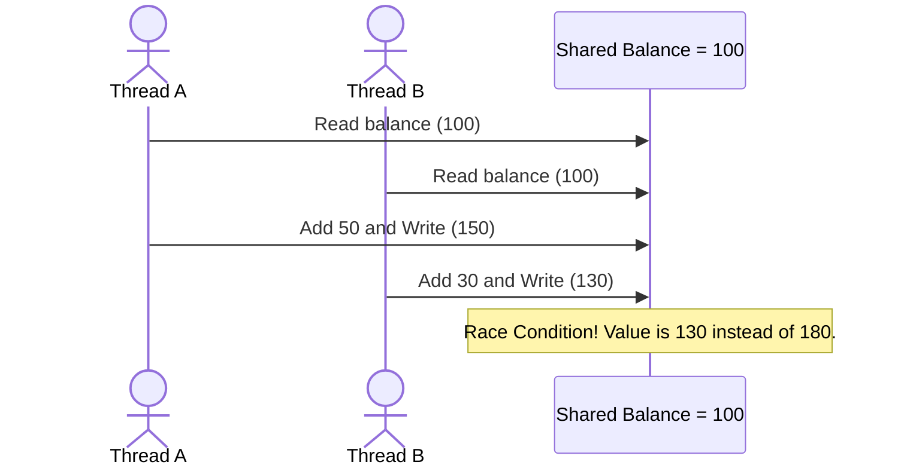

# Low-Level Design Wiki: Concurrency & Thread-Safety in Python

In production systems, designing for high write throughput and concurrent requests requires an understanding of multithreading, concurrency, and synchronization. This guide details how to implement thread-safe low-level designs in Python.

---

## 1. Concurrency vs. Parallelism in Python

- **Concurrency**: Managing multiple tasks by interleaving their execution (making progress on more than one task at a time). Best for **I/O-bound** workloads (database queries, network calls).
- **Parallelism**: Executing multiple tasks simultaneously on different CPU cores. Best for **CPU-bound** workloads (cryptography, data analysis).

### The Global Interpreter Lock (GIL)
CPython (the default Python implementation) uses a mutex called the **GIL** to prevent multiple native threads from executing Python bytecodes at once.
- **Impact on Threading**: Python threads are excellent for I/O-bound tasks because the GIL is released during blocking system operations (like disk read/write or network socket waiting). However, threading will **not** speed up CPU-bound tasks in Python.
- **For CPU-bound tasks**: Use Python's `multiprocessing` module (which spawns separate OS processes with their own GIL-free memory spaces).

---

## 2. Concurrency Units in Python

| Unit | Managed By | Overhead | GIL Bound? | Best For |
| :--- | :--- | :--- | :--- | :--- |
| **Process** | Operating System | High (separate memory) | No | CPU-bound tasks |
| **Thread** | Operating System | Medium (shared memory) | Yes | I/O-bound tasks, shared-state |
| **Coroutine (Asyncio)** | Python Event Loop | Very Low (cooperative) | Yes | Massively concurrent I/O |

---

## 3. Race Conditions & Thread-Safety

A **race condition** occurs when multiple threads read and write a shared variable concurrently, and the final value depends on the exact order/timing of execution.



### Before (Bad) - Unsafe Shared State
In this example, multiple threads calling `deposit` or `withdraw` concurrently will cause inconsistent balances due to non-atomic execution of `+=` and `-=`.

```python
import time
from threading import Thread
from typing import List

class UnsafeBankAccount:
    def __init__(self) -> None:
        self.balance: float = 0.0

    def deposit(self, amount: float) -> None:
        current = self.balance
        time.sleep(0.001)  # Simulates context switch
        self.balance = current + amount
```

### After (Good) - Thread-Safe State using `threading.Lock`
Use Python's `threading.Lock` to ensure mutual exclusion, turning the critical section into an atomic operation.

```python
from threading import Lock

class SafeBankAccount:
    def __init__(self) -> None:
        self.balance: float = 0.0
        self.lock: Lock = Lock()

    def deposit(self, amount: float) -> None:
        with self.lock:  # Automatically acquires and releases the lock
            self.balance += amount
```

---

## 4. Python Synchronization Primitives

### A. Mutex Lock (`threading.Lock`)
A mutual exclusion lock. Only one thread can acquire it at a time. Blocking calls wait until the lock is released.
- **Usage**: Protecting simple critical sections.

### B. Reentrant Lock (`threading.RLock`)
A lock that can be acquired **multiple times** by the same thread without causing a deadlock. Internally tracks recursion levels.
- **Usage**: Recursive functions or nested methods within the same class that both acquire the lock.

### C. Semaphore (`threading.Semaphore`)
A counter-based lock. Allows up to `N` concurrent threads to acquire it.
- **Usage**: Rate-limiting access to a shared resource (e.g., limiting database connections to 5).

```python
from threading import Semaphore

class DBConnectionPool:
    def __init__(self, limit: int) -> None:
        self.semaphore = Semaphore(limit)

    def access_resource(self) -> None:
        with self.semaphore:
            print("Accessing database connection...")
            # Perform database query
```

### D. Event (`threading.Event`)
A simple flag indicating whether a condition has been met. Threads can wait (`event.wait()`) until the flag is set (`event.set()`) by another thread.
- **Usage**: Signaling startup or shutdown events across threads.

---

## 5. Concurrency Patterns

### The Producer-Consumer Pattern
Decouple task creation from task execution using a thread-safe FIFO queue (`queue.Queue`).

```python
import queue
import time
from threading import Thread

# Thread-safe queue
task_queue = queue.Queue(maxsize=10)

def producer() -> None:
    for i in range(5):
        task_queue.put(f"Task-{i}")
        print(f"Produced: Task-{i}")
        time.sleep(0.1)

def consumer() -> None:
    while True:
        try:
            task = task_queue.get(timeout=1.0)
            print(f"Consumed: {task}")
            task_queue.task_done()
        except queue.Empty:
            break  # Stop when queue is empty and no new tasks arrive

# Spawning threads
t1 = Thread(target=producer)
t2 = Thread(target=consumer)

t1.start()
t2.start()
t1.join()
t2.join()
```
