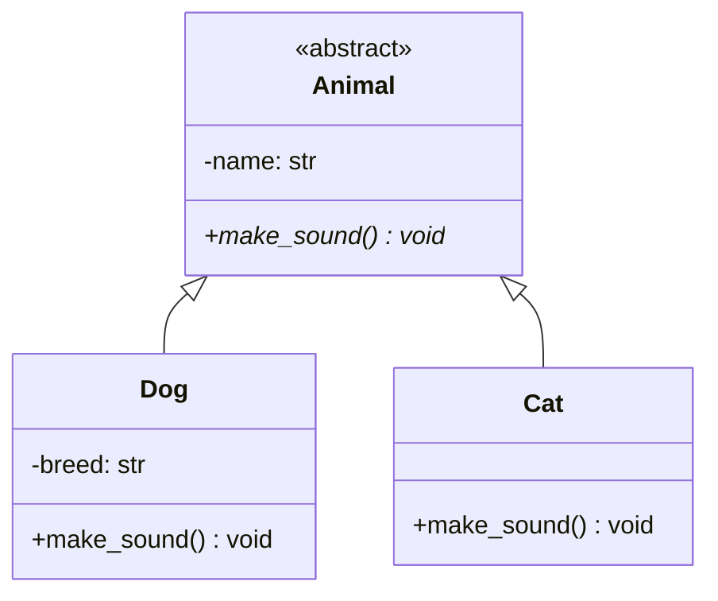
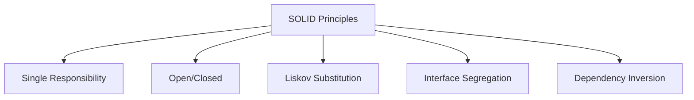

# Low-Level Design Wiki: Object-Oriented Programming (OOP) & SOLID in Python

Welcome to the foundation of Low-Level Design (LLD). Writing high-quality software requires a solid understanding of Object-Oriented Programming (OOP) and the SOLID design principles. This document provides a zero-to-advanced roadmap in Python.

---

## 1. Pillars of OOP in Python

OOP is structured around four core pillars. Let's look at how Python implements each, accompanied by practical examples.



### A. Encapsulation
Encapsulation is the bundling of data (attributes) and methods that operate on that data into a single unit (class), while restricting direct access to some of the object's components.
* Python uses name prefixing to denote access levels:
  * **Public**: `variable_name` (Accessible everywhere)
  * **Protected**: `_variable_name` (Treated as private by convention; subclass accessible)
  * **Private**: `__variable_name` (Uses name mangling to restrict access from outside the class scope)

```python
class BankAccount:
    def __init__(self, owner: str, balance: float):
        self.owner = owner          # Public
        self._account_type = "Savings" # Protected
        self.__balance = balance     # Private (mangled to _BankAccount__balance)

    def deposit(self, amount: float) -> None:
        if amount > 0:
            self.__balance += amount

    # Getter for balance
    def get_balance(self) -> float:
        return self.__balance
```

### B. Abstraction
Abstraction hides complex implementation details and only reveals the essential features of an object. In Python, this is achieved using the `abc` module (Abstract Base Classes).

```python
from abc import ABC, abstractmethod

class PaymentGateway(ABC):
    @abstractmethod
    def process_payment(self, amount: float) -> bool:
        """Process payment through gateway."""
        pass

class StripePayment(PaymentGateway):
    def process_payment(self, amount: float) -> bool:
        print(f"Processing ${amount} via Stripe API...")
        return True
```

### C. Inheritance
Inheritance allows a new class (subclass) to inherit attributes and methods from an existing class (parent class). This promotes code reuse.

```python
class Vehicle:
    def __init__(self, brand: str):
        self.brand = brand

    def start_engine(self) -> str:
        return "Vroom!"

class Car(Vehicle):  # Car inherits from Vehicle
    def __init__(self, brand: str, doors: int):
        super().__init__(brand)
        self.doors = doors
```

### D. Polymorphism
Polymorphism means "many forms". It allows different classes to define methods with the same name, which can be executed differently based on the object calling them.

```python
class Dog:
    def make_sound(self) -> str:
        return "Woof!"

class Cat:
    def make_sound(self) -> str:
        return "Meow!"

def animal_sound_service(animal) -> None:
    # Works with any object implementing make_sound
    print(animal.make_sound())
```

---

## 2. Advanced Python OOP Concepts

### A. `@property`, `@classmethod`, and `@staticmethod`
- **`@property`**: Turns a method into a read-only/writable attribute using getters and setters.
- **`@classmethod`**: Binds a method to the class, not the instance. Receives `cls` as the first parameter. Used for factory methods.
- **`@staticmethod`**: Binds a method to the class but behaves like a regular function. Receives no implicit arguments.

```python
class Temperature:
    def __init__(self, celsius: float):
        self._celsius = celsius

    @property
    def fahrenheit(self) -> float:
        return (self._celsius * 9/5) + 32

    @fahrenheit.setter
    def fahrenheit(self, value: float) -> None:
        self._celsius = (value - 32) * 5/9

    @classmethod
    def from_fahrenheit(cls, value: float) -> "Temperature":
        celsius = (value - 32) * 5/9
        return cls(celsius)

    @staticmethod
    def is_freezing(celsius: float) -> bool:
        return celsius <= 0
```

### B. Python Magic (Dunder) Methods
Magic methods begin and end with double underscores (`__`). They allow objects to hook into Python's built-in behaviors.

| Magic Method | Purpose | Example |
|---|---|---|
| `__str__(self)` | User-friendly string representation | `str(obj)` |
| `__repr__(self)` | Developer/unambiguous string representation | `repr(obj)` |
| `__call__(self)` | Makes an instance callable like a function | `obj()` |
| `__eq__(self, other)` | Evaluates equality comparison | `obj1 == obj2` |
| `__enter__` / `__exit__` | Code execution inside context managers | `with obj:` |

```python
class SmartBook:
    def __init__(self, title: str, pages: int):
        self.title = title
        self.pages = pages

    def __str__(self) -> str:
        return f"'{self.title}' ({self.pages} pages)"

    def __repr__(self) -> str:
        return f"SmartBook(title='{self.title}', pages={self.pages})"

    def __eq__(self, other: object) -> bool:
        if not isinstance(other, SmartBook):
            return NotImplemented
        return self.title == other.title and self.pages == other.pages
```

---

## 3. SOLID Principles in Python

SOLID is a set of five design principles to make software designs more understandable, flexible, and maintainable.



### 1. Single Responsibility Principle (SRP)
> **A class should have one, and only one, reason to change.**

#### Before (Bad)
This class handles user details, DB persistence, and email notifications.
```python
class User:
    def __init__(self, username: str, email: str):
        self.username = username
        self.email = email

    def save_to_database(self) -> None:
        print("Saving user to database...")

    def send_welcome_email(self) -> None:
        print("Sending welcome email...")
```

#### After (Good)
Separate each responsibility into its own class.
```python
class User:
    def __init__(self, username: str, email: str):
        self.username = username
        self.email = email

class UserRepository:
    def save(self, user: User) -> None:
        print(f"Saving {user.username} to DB...")

class EmailService:
    def send_welcome(self, user: User) -> None:
        print(f"Sending email to {user.email}...")
```

---

### 2. Open/Closed Principle (OCP)
> **Software entities should be open for extension, but closed for modification.**

#### Before (Bad)
If we want to support a new payment method (e.g., PayPal), we must modify `process_payment` code.
```python
class PaymentProcessor:
    def process_payment(self, payment_type: str, amount: float) -> None:
        if payment_type == "credit_card":
            print(f"Processing CC payment of ${amount}")
        elif payment_type == "paypal":
            print(f"Processing PayPal payment of ${amount}")
```

#### After (Good)
Use abstraction to introduce new payment types without modifying existing processors.
```python
from abc import ABC, abstractmethod

class PaymentMethod(ABC):
    @abstractmethod
    def pay(self, amount: float) -> None:
        pass

class CreditCardPayment(PaymentMethod):
    def pay(self, amount: float) -> None:
        print(f"Processing Credit Card payment of ${amount}")

class PayPalPayment(PaymentMethod):
    def pay(self, amount: float) -> None:
        print(f"Processing PayPal payment of ${amount}")

class PaymentProcessor:
    def process(self, payment_method: PaymentMethod, amount: float) -> None:
        payment_method.pay(amount)
```

---

### 3. Liskov Substitution Principle (LSP)
> **Subtypes must be substitutable for their base types without altering the correctness of the program.**

#### Before (Bad)
Ostrich inherits from Bird, but calling `fly()` on Ostrich throws an exception, breaking expectations on the parent type.
```python
class Bird:
    def fly(self) -> str:
        return "Flying high!"

class Ostrich(Bird):
    def fly(self) -> str:
        raise NotImplementedError("Ostriches cannot fly!")
```

#### After (Good)
Restructure the class hierarchy to represent real behaviors correctly.
```python
class Bird:
    pass

class FlyingBird(Bird):
    def fly(self) -> str:
        return "Flying high!"

class Ostrich(Bird):
    def run(self) -> str:
        return "Running fast!"
```

---

### 4. Interface Segregation Principle (ISP)
> **Clients should not be forced to depend on methods they do not use.**

#### Before (Bad)
A simple Printer is forced to implement `fax` and `scan` methods which it cannot perform.
```python
class MultiFunctionDevice(ABC):
    @abstractmethod
    def print_doc(self) -> None: pass
    @abstractmethod
    def scan_doc(self) -> None: pass
    @abstractmethod
    def fax_doc(self) -> None: pass

class SimplePrinter(MultiFunctionDevice):
    def print_doc(self) -> None:
        print("Printing...")
    def scan_doc(self) -> None:
        raise NotImplementedError()
    def fax_doc(self) -> None:
        raise NotImplementedError()
```

#### After (Good)
Split the interfaces into specific, single-purpose abstractions.
```python
class Printer(ABC):
    @abstractmethod
    def print_doc(self) -> None: pass

class Scanner(ABC):
    @abstractmethod
    def scan_doc(self) -> None: pass

class Fax(ABC):
    @abstractmethod
    def fax_doc(self) -> None: pass

class SimplePrinter(Printer):
    def print_doc(self) -> None:
        print("Printing...")

class EliteCopier(Printer, Scanner):
    def print_doc(self) -> None:
        print("Printing...")
    def scan_doc(self) -> None:
        print("Scanning...")
```

---

### 5. Dependency Inversion Principle (DIP)
> **High-level modules should not depend on low-level modules. Both should depend on abstractions.**

#### Before (Bad)
The high-level `NotificationService` depends directly on the low-level `EmailSender` implementation.
```python
class EmailSender:
    def send_email(self, msg: str) -> None:
        print(f"Email sent: {msg}")

class NotificationService:
    def __init__(self):
        self.sender = EmailSender()  # Direct tight coupling

    def send(self, msg: str) -> None:
        self.sender.send_email(msg)
```

#### After (Good)
Decouple using interfaces. Pass the dependency through constructor injection.
```python
class MessageSender(ABC):
    @abstractmethod
    def send(self, msg: str) -> None:
        pass

class EmailSender(MessageSender):
    def send(self, msg: str) -> None:
        print(f"Email sent: {msg}")

class SMSSender(MessageSender):
    def send(self, msg: str) -> None:
        print(f"SMS sent: {msg}")

class NotificationService:
    def __init__(self, sender: MessageSender):
        self.sender = sender  # Loosely coupled to abstraction

    def notify(self, msg: str) -> None:
        self.sender.send(msg)
```
