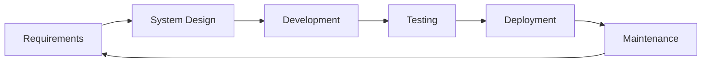
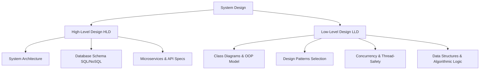
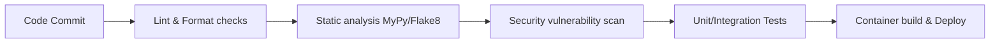

# Low-Level Design Wiki: Software Development Life Cycle (SDLC)

Software engineering is not just about writing code; it is about building reliable, maintainable, and scalable products. The **Software Development Life Cycle (SDLC)** provides a structured framework for planning, developing, testing, deploying, and maintaining software applications.

---

## 1. The SDLC Phases

A standard software development life cycle follows six key stages:

### 1. Requirements Gathering & Analysis
- **Goal**: Understand what needs to be built and why.
- **Output**: Software Requirement Specification (SRS) document, user stories, use cases.
- **Role in LLD**: LLD cannot begin without stable functional and non-functional requirements.

### 2. System Design (HLD & LLD)
System design is divided into two distinct levels:

| Dimension | High-Level Design (HLD) | Low-Level Design (LLD) |
|---|---|---|
| **Focus** | System-wide architecture and system components. | Component-internal architecture, classes, and interactions. |
| **Audience** | Product managers, architects, lead developers. | Software engineers, code reviewers, testers. |
| **Contents** | Microservices, external integrations, deployment infra. | Class diagrams, sequence diagrams, design patterns, method signatures. |
| **Tooling** | AWS/Azure architecture diagrams, API specs (OpenAPI). | UML tools (Mermaid, Draw.io), pseudo-code, code skeletons. |

### 3. Coding & Development
- **Goal**: Translate LLD class skeletons and specifications into clean, typed, and unit-tested code.
- **Output**: Source code repository, initial local validations.

### 4. Testing
- **Goal**: Verify that the code behaves exactly as described in the requirements.
- **Types of Testing**:
  1. **Unit Testing**: Tests individual classes/methods in isolation (e.g., using `pytest` and mocks).
  2. **Integration Testing**: Verifies that components interact correctly.
  3. **End-to-End (E2E) Testing**: Simulates real-user interactions through the UI or API gateways.

### 5. Deployment & Release (CI/CD)
- **Goal**: Safely package and push the software to production.
- **Concepts**:
  - **CI (Continuous Integration)**: Running style checks, static type checks, and tests on every code push (e.g., GitHub Actions).
  - **CD (Continuous Deployment)**: Deploying the build artifact to staging/production automatically.

### 6. Operations & Maintenance
- **Goal**: Keep the system healthy, fix bugs, and implement telemetry (logging, metrics, tracing).

---

## 2. SDLC Methodologies

### A. Waterfall Model
A sequential design process where progress flows steadily downwards (like a waterfall) through the phases.
- **Best for**: Small, well-defined projects with stable requirements.
- **Cons**: Extremely rigid; changes late in the cycle are highly expensive.

### B. Agile & Scrum
An iterative approach that focuses on continuous feedback, speed to market, and cross-functional teamwork.
- **Key Artifacts**: Sprint backlog, product backlog, burn-down charts.
- **Core Ceremonies**: Daily Standups, Sprint Planning, Sprint Review, Sprint Retrospective.

### C. DevOps & DevSecOps
DevOps bridges the gap between software development (Dev) and operations (Ops) to deploy faster and with higher stability. DevSecOps integrates automated security checks directly into this cycle.

