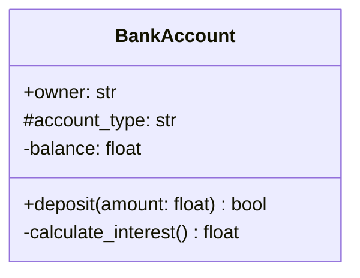
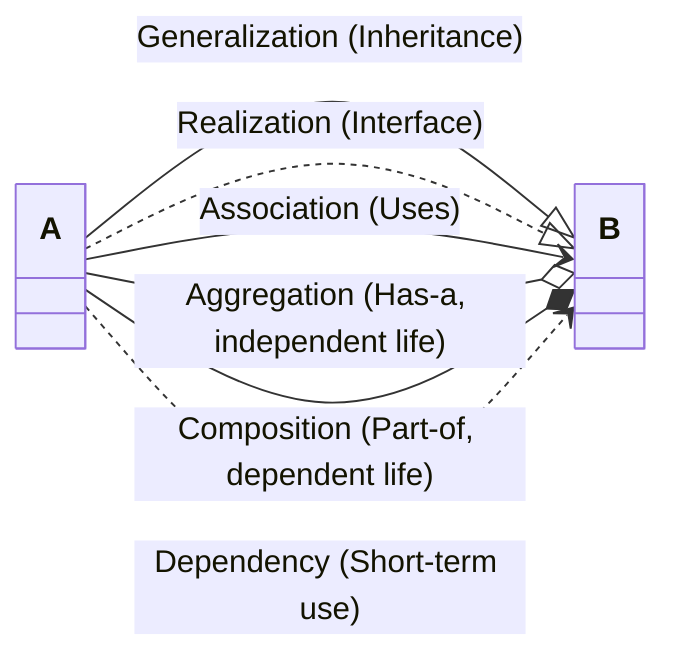
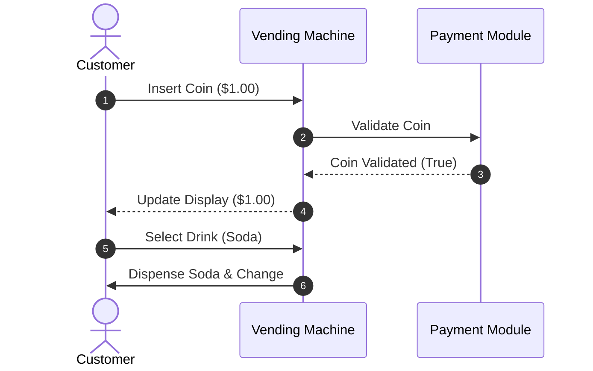
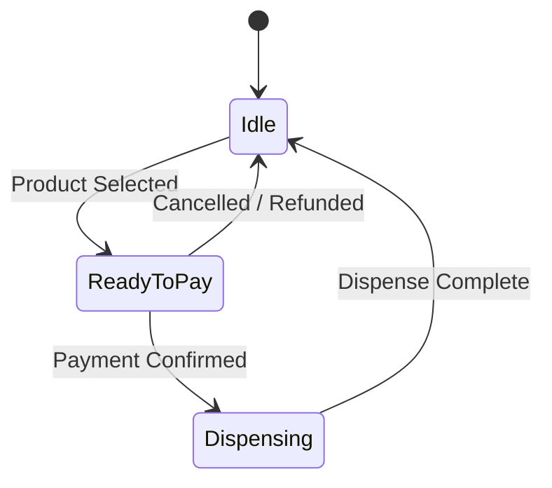
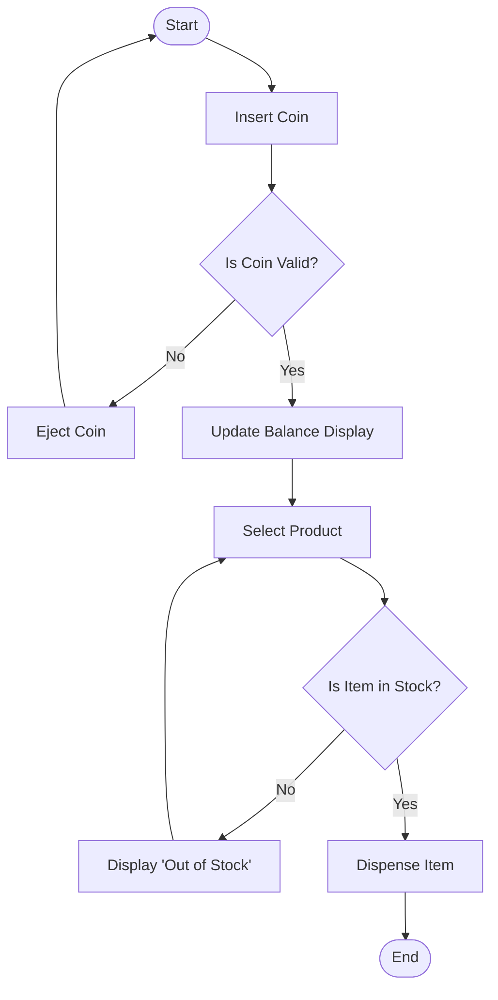

# Low-Level Design Wiki: Unified Modeling Language (UML) Guide

In Low-Level Design (LLD), **UML (Unified Modeling Language)** acts as our blueprinting language. It provides a standardized way to visualize system structures (classes, interfaces, attributes, and methods) and system behaviors (interactions, state shifts, and activities).

This guide walks you through reading and drawing UML diagrams, specifically using **Mermaid.js**, which renders directly in Markdown.

---

## 1. Class Diagrams (Structural Blueprint)

Class diagrams show the static structure of the system, illustrating the classes, their attributes, operations (methods), and the relationships among them.

### Representing a Class in UML

A class box is divided into three sections:
1. **Top**: Class Name (and stereotype like `<<abstract>>` or `<<interface>>`).
2. **Middle**: Attributes (properties).
3. **Bottom**: Methods (functions).

#### Access Modifiers
- `+` : Public
- `-` : Private
- `#` : Protected
- `~` : Package/Internal



---

## 2. Class Relationships (The Core of LLD)

Understanding how classes connect is critical for applying design patterns. Here are the six primary relationships:



### A. Generalization (Inheritance)
Indicates a subclass-parent relationship. A subclass inherits the structure and behavior of its parent class.
- **Mermaid**: `Subclass --|> Parent`
- **Example**: `Dog --|> Animal`

### B. Realization (Implementation)
Indicates a class implementing an abstract interface or abstract class.
- **Mermaid**: `ConcreteClass ..|> Interface`
- **Example**: `StripeGateway ..|> PaymentGateway`

### C. Association
Represents a structural relationship between two classes. One class holds a reference to another.
- **Mermaid**: `User --> Profile` (Direct association)
- **Example**: A User has a Profile instance.

### D. Aggregation (Weak Has-A)
A relationship where one object is a container or container-like owner of another, but the child objects **can exist independently** of the parent.
- **Mermaid**: `Parent --o Child`
- **Example**: `Department --o Professor`. If a Department is deleted, the Professors still exist.

### E. Composition (Strong Has-A)
A relationship where the child object **cannot exist independently** of the parent. If the parent is destroyed, the child is destroyed too.
- **Mermaid**: `Parent --* Child`
- **Example**: `House --* Room`. If the House is demolished, the Rooms cease to exist.

### F. Dependency
A weak relationship indicating that one class depends on another temporarily (e.g., passing a parameter into a method, or creating a local instance within a method).
- **Mermaid**: `Client ..> Service`
- **Example**: A `ReportGenerator` depends on `PdfWriter` to export a file.

---

## 3. Behavioral UML Diagrams

### A. Sequence Diagrams (Interactions over Time)
Sequence diagrams illustrate how objects interact with each other and in what order (chronological sequence) to achieve a specific workflow.



### B. State Diagrams (State Transitions)
State diagrams describe the behavior of a single object as it transitions through different states in response to external events. Highly crucial for the **State Pattern**.



### C. Use Case Diagrams (User Interactions)
Use case diagrams represent the system's external actors and the specific actions (use cases) they perform. Although Mermaid doesn't have a dedicated native use-case shape, we use standard block architectures to build them cleanly.

```mermaid
flowchart LR
    actor User as "Customer"
    actor Admin as "System Administrator"
    
    subgraph VendingMachine ["Boundary: Vending Machine"]
        UC1["Select Product"]
        UC2["Insert Coins"]
        UC3["Collect Refund"]
        UC4["Restock Inventory"]
    end
    
    User --> UC1
    User --> UC2
    User --> UC3
    
    Admin --> UC4
```

### D. Activity Diagrams (Workflow Logic)
Activity diagrams represent the flow of control from one activity to another, showcasing decision pathways and parallel executions (fork/join).


