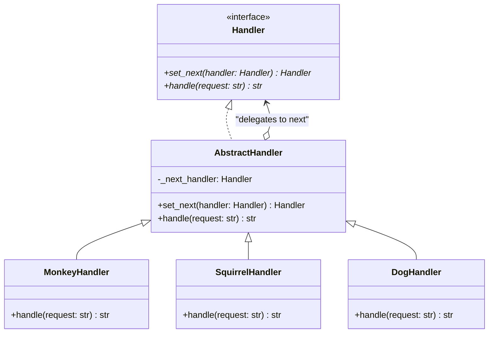

# Chain of Responsibility Pattern

## Real-World Analogy
Consider a technical support call center. When you dial customer support, a basic robotic automated operator greets you first. If it cannot answer your query, it routes the call to a tier-1 support technician. If your issue is too advanced, the technician forwards your call to a tier-2 specialist, who might eventually escalate it to a senior software engineer.

---

## Mermaid UML Diagram

---

## Pros and Cons

| Pros | Cons |
| :--- | :--- |
| **Control Request Order**: You can control the order of request handling. | **Guaranteed Unhandled Requests**: A request can fall off the end of the chain without ever being processed. |
| **Single Responsibility Principle**: Decouples classes that invoke operations from classes that perform them. | **Debugging Complexity**: The chain flow can be difficult to track and debug when analyzing log traces. |
| **Open/Closed Principle**: You can introduce new handlers without breaking existing client code. | |

---

## Performance and Concurrency Notes
- **Performance**: High efficiency. However, if the chain is long and requests must travel to the end, the system incurs method call stack overhead. Avoid extremely deep chains (e.g. >100 handlers) or use iterative traversal instead of recursion if recursion limits are a concern.
- **Thread Safety**: Linking the chain (modifying `_next_handler`) is a state-changing operation. If done at initialization, it is thread-safe. If handlers dynamically adjust their links at runtime in multiple threads, lock the linkage setup.
