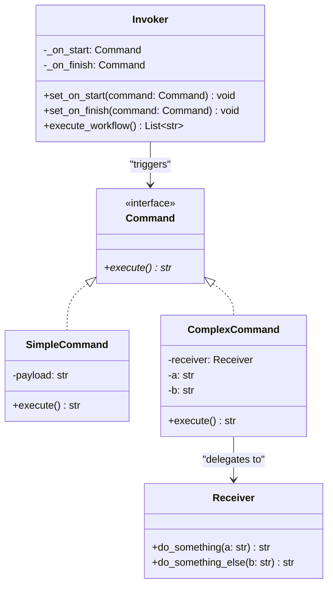

# Command Pattern

## Real-World Analogy
Consider ordering food in a restaurant. You (the client) give your order details (e.g. "Steak and Red Wine") to a waiter (the Invoker). The waiter writes this down on a slip of paper (the Command). The slip is placed in a queue in the kitchen. Eventually, the chef (the Receiver) reads the slip and cooks the meal. 

The waiter does not need to know how to cook the steak, and the chef does not need to know the customer personally. The paper slip encapsulates the request and enables queuing, scheduling, or re-ordering.

---

## Mermaid UML Diagram

---

## Pros and Cons

| Pros | Cons |
| :--- | :--- |
| **Decoupling**: Decouples classes that invoke operations from classes that perform them. | **Many Classes**: The code can get complex as you define dozens of concrete command classes. |
| **Undo / Redo Support**: Since the command object encapsulates state and operations, it is easy to implement undo/redo stacks. | |
| **Queuing and Scheduling**: You can assemble simple commands into composite workflows or queue commands for execution. | |
| **Open/Closed Principle**: You can introduce new commands without breaking existing client code. | |

---

## Performance and Concurrency Notes
- **Performance**: High efficiency. Command creation creates lightweight objects. Memory footprint is minimal.
- **Thread Safety**: Command objects themselves can store temporary execution details or state. If a command is shared across threads, or if multiple threads trigger the same command object, access should be protected with locks to prevent concurrent write corruption.
