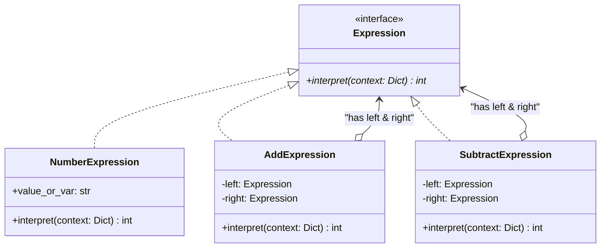

# Interpreter Pattern

## Real-World Analogy
Consider musical notation or reading a piece of sheet music. A musical score defines a language of pitch, time, dynamics, and keys. When a musician reads the score and plays the corresponding notes on an instrument, they act as the interpreter. Each note, bar, rest, and signature is an expression in a grammar, and playing the song is the evaluation process.

---

## Mermaid UML Diagram

---

## Pros and Cons

| Pros | Cons |
| :--- | :--- |
| **Easy Grammatical Extension**: You can easily change or extend the grammar by adding new expression subclasses. | **Complexity**: Creating grammars with dozens of rules leads to complex class hierarchies that are hard to maintain. |
| **Separate Parsing from Evaluation**: The syntax tree structures evaluation, separating it from variable contexts. | **Performance Overhead**: Evaluating highly nested expressions recursively consumes memory and CPU execution time. |

---

## Performance and Concurrency Notes
- **Performance**: Standard Interpreter structures evaluate syntax trees recursively. For complex or large trees, this runs slowly and can hit Python's default recursion limit. If parsing performance is critical, consider compile-to-bytecode techniques or compiling to abstract machine operations instead of executing syntax trees directly.
- **Thread Safety**: Expression trees are usually stateless (their logic is static once built). If different threads run `interpret()` concurrently with distinct context dicts, it is completely thread-safe. If they share a mutable context dictionary, access to the context must be synchronized.
