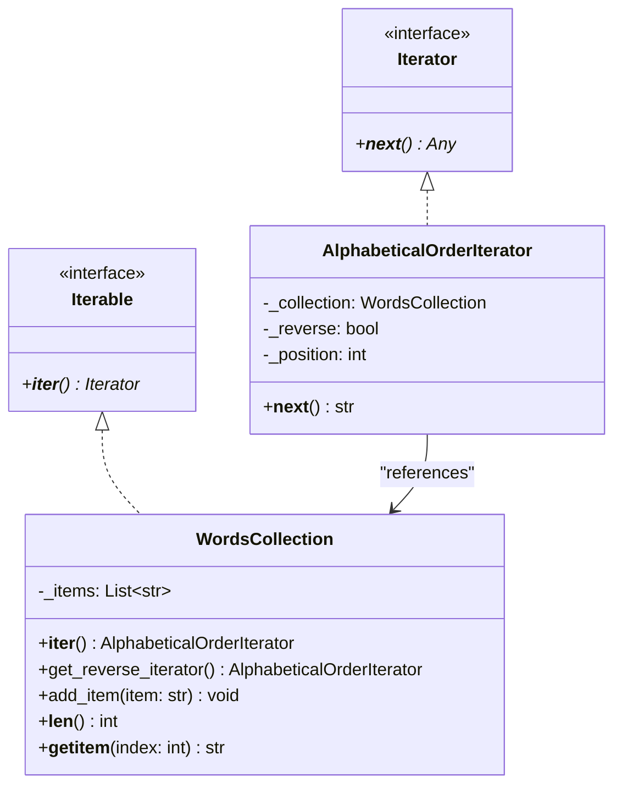

# Iterator Pattern

## Real-World Analogy
Consider a tourist visiting a museum. There are various ways to browse the museum: you can follow a tour guide (a sequential traversal), follow an audio guide program, or simply wander around randomly. In all cases, the museum galleries (the collection) remain unchanged. The guide or method of traversal (the Iterator) keeps track of your current location and determines which exhibit you see next.

---

## Mermaid UML Diagram

---

## Pros and Cons

| Pros | Cons |
| :--- | :--- |
| **Clean Client Code**: Decouples the client from collection implementation details, reducing code clutter. | **Overkill for Small Lists**: Applying this pattern to simple array lists adds unnecessary class overhead. |
| **Multiple Traversals**: You can run multiple iteration processes over the same collection simultaneously because each iterator contains its own traversal state. | **Less Efficient**: Using wrappers can be less performant than iterating via direct array indexing. |
| **Single Responsibility Principle**: Isolates collection iteration algorithms from collection storage structure. | |

---

## Performance and Concurrency Notes
- **Performance**: Standard python iterator operations (`__next__`) are highly optimized. However, they run slightly slower than native C-level loops over standard lists.
- **Thread Safety / Modification Concurrency**: Modifying a collection (adding or removing items) while iterating over it will cause index shifting. This leads to skipped items or `IndexError` (or `RuntimeError` in standard python dicts). Always synchronize accesses or make a snapshot copy of the collection if concurrent modifications are expected.
