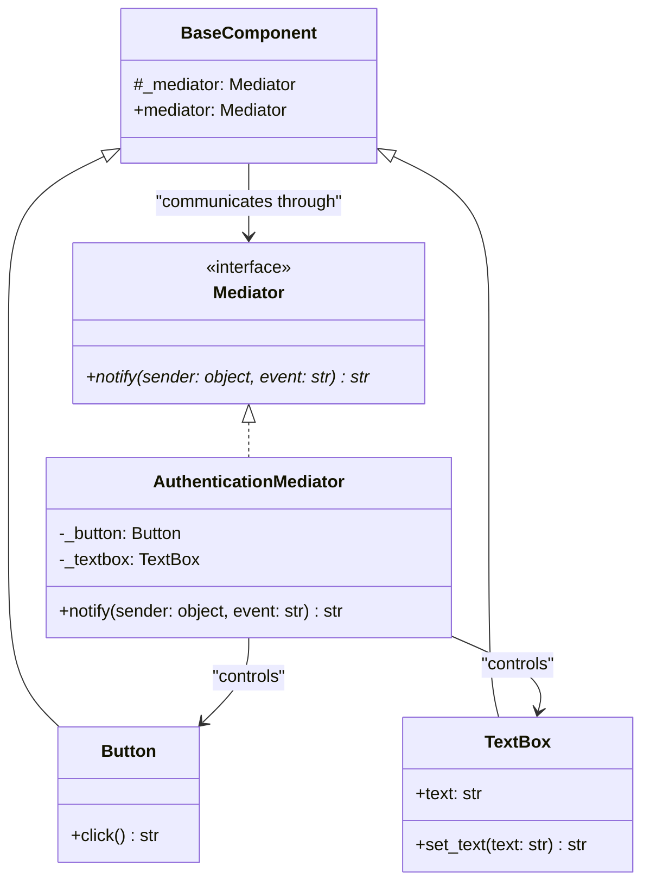

# Mediator Pattern

## Real-World Analogy
Consider Air Traffic Control (ATC). Pilots flying airplanes near an airport do not communicate directly with each other to coordinate landings and departures. If they did, it would lead to chaotic radio traffic and high collision risks. Instead, they all communicate with the ATC tower (the Mediator). The tower monitors all planes, schedules runways, and instructs pilots on landing order.

---

## Mermaid UML Diagram

---

## Pros and Cons

| Pros | Cons |
| :--- | :--- |
| **Loose Coupling**: Components (Colleagues) don't need to hold references to one another, keeping them independent. | **God Object Risk**: Over time, a mediator can grow extremely complex and turn into a monolithic "god class". |
| **Single Responsibility Principle**: Centralizes control communications and interaction logic in a single coordinator class. | |
| **Reusability**: You can reuse individual colleague components in different contexts by swapping out the mediator. | |

---

## Performance and Concurrency Notes
- **Performance**: High performance. Calling the mediator is a direct method delegation. There is virtually no lookup overhead.
- **Thread Safety**: The mediator manages the state interactions of multiple components (e.g., TextBox text, button actions). If different threads trigger colleague operations simultaneously, the mediator's notifications should be thread-safe. Use locks inside the mediator's `notify` method if coordinating mutable component state.
