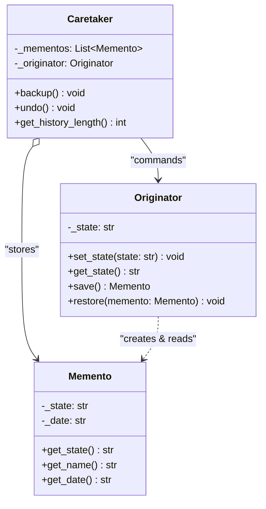

# Memento Pattern

## Real-World Analogy
Consider editing text in a document editor like MS Word or Google Docs. As you type, the editor periodically saves snapshots of your document. These snapshots (the Mementos) are kept in an undo history stack (the Caretaker). If you decide to revert your edits (acting as the client trigger), you click the Undo button, and the editor (the Originator) restores its text content from the most recent snapshot.

---

## Mermaid UML Diagram

---

## Pros and Cons

| Pros | Cons |
| :--- | :--- |
| **Preserve Encapsulation**: You can produce snapshots of an object's state without violating its encapsulation boundary. | **Memory Consumption**: If clients create mementos frequently and the state size is large, it can consume vast amounts of RAM. |
| **Simplified Originator**: Simplifies the Originator's code by delegating historical state tracking to the Caretaker. | **GC / Lifecycle Complexity**: Caretakers must actively clean up obsolete mementos so they don't leak memory. |

---

## Performance and Concurrency Notes
- **Performance**: Instantaneous state serialization. If the state object contains huge files/arrays, deep-copying them will slow down execution. Consider incremental mementos (storing only state diffs/changes rather than full state clones) for large documents.
- **Thread Safety**: Restoring or saving states in multi-threaded programs will lead to corrupt state configurations if context switching occurs during write operations. Always protect the Originator's `save()`, `restore()`, and state mutations with a lock.
