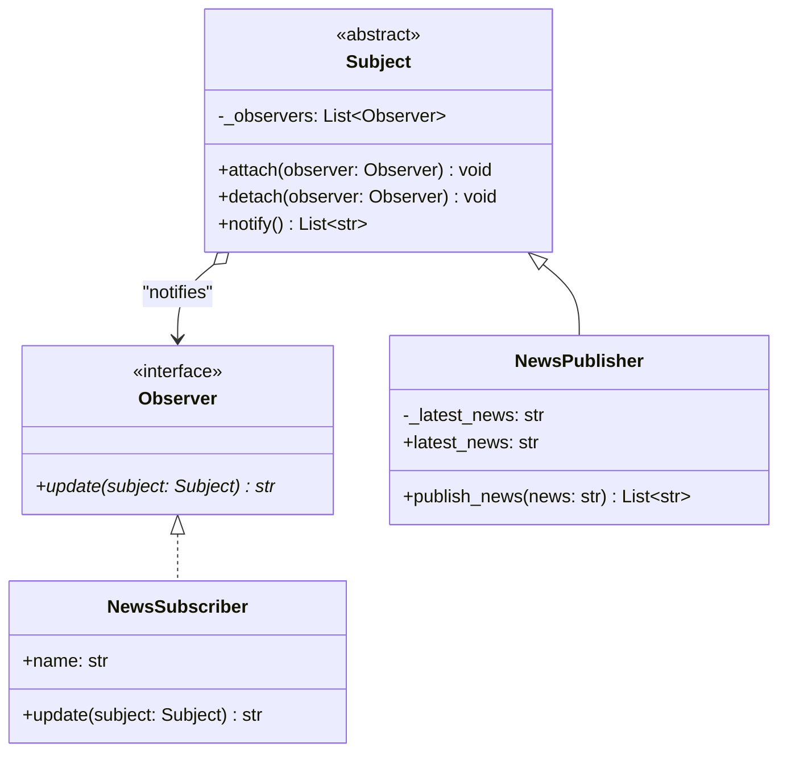

# Observer Pattern

## Real-World Analogy
Consider subscribing to a newspaper or a magazine. Instead of walking to the local newsstand every morning to check if a new issue has been printed (polling, which is highly inefficient), you subscribe to the publisher. The publisher maintains a list of subscribers. Whenever a new edition is published, the publisher automatically sends it directly to your home mailbox (notification). 

---

## Mermaid UML Diagram

---

## Pros and Cons

| Pros | Cons |
| :--- | :--- |
| **Open/Closed Principle**: You can introduce new subscriber (observer) classes without modifying the publisher's code. | **Random Order**: Observers are notified in random or sequential order, and they cannot rely on a specific execution sequence. |
| **Decoupling**: The relationship between the publisher and subscribers is loosely coupled. | **Memory Leaks**: If subscribers are not detached (unsubscribed) when they are destroyed, they can lead to memory leaks (lapsed listener problem). |

---

## Performance and Concurrency Notes
- **Performance**: Notifications run in $O(N)$ where $N$ is the number of observers. If there are thousands of observers, publishing an update synchronously will block the main execution thread. In high-scale architectures, make notifications asynchronous using thread pools, event loops, or message brokers.
- **Thread Safety**: Accessing the observers list while modifying it (attaching/detaching observers) is prone to concurrent modification errors. In multi-threaded programs, use a lock inside `attach()`, `detach()`, and `notify()` methods to synchronize operations on the `_observers` collection.
