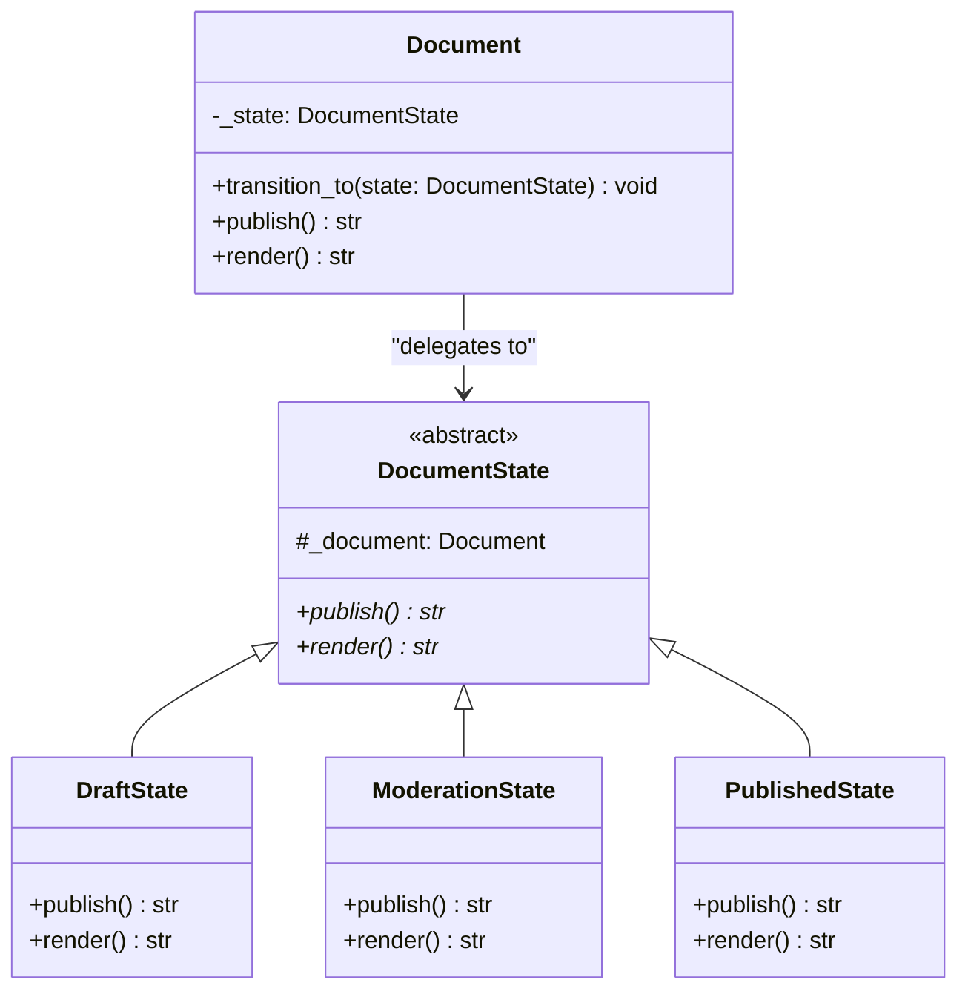

# State Pattern

## Real-World Analogy
Consider a document in a content management system (CMS). A newly created document is in the **Draft** state. When finished, the author publishes it, moving it to **Moderation**. In Moderation, editors review it. If approved, they publish it, moving it to **Published**. 

The document behaves differently depending on its state: in Draft, anyone can edit it but the public can't see it; in Moderation, it's read-only for authors; in Published, it is public and cannot be edited.

---

## Mermaid UML Diagram

---

## State vs Strategy Pattern Comparison

| Feature | State Pattern | Strategy Pattern |
| :--- | :--- | :--- |
| **Intent** | Changes behavior based on internal state changes. | Changes execution algorithm or strategy. |
| **Awareness** | States are usually aware of other states and trigger transitions. | Strategies are independent and unaware of other strategies. |
| **Client Control** | Transition is managed automatically by the context/states. | Client chooses and configures the strategy explicitly. |

---

## Pros and Cons

| Pros | Cons |
| :--- | :--- |
| **Single Responsibility Principle**: Group state-specific code into individual classes. | **Overkill for Simple State Machines**: If a class only has 2-3 states and simple transitions, using this pattern can add unnecessary complexity. |
| **Eliminates Conditional Duplication**: Simplifies complex state conditions (`if-else` or `switch`). | |
| **Open/Closed Principle**: You can introduce new states without changing existing state classes or context code. | |

---

## Performance and Concurrency Notes
- **Performance**: High performance. State changes only require changing an object reference.
- **Thread Safety**: The `Document` context holds mutable state. If multiple threads concurrently publish or change state on the same `Document` instance, race conditions will occur. Protect state transitions using a `threading.Lock` inside the `transition_to` method.
