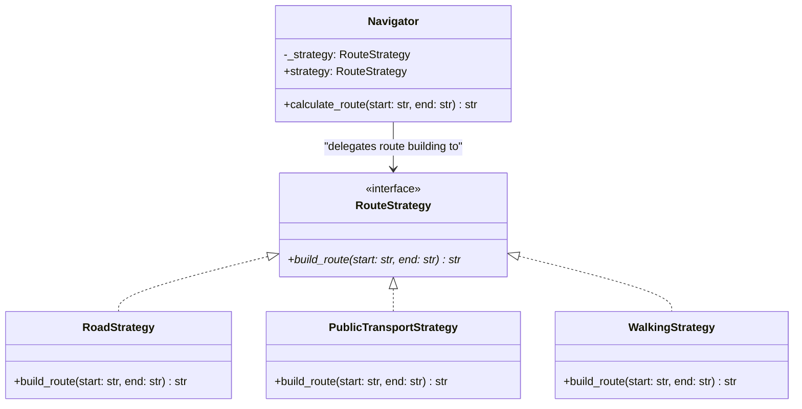

# Strategy Pattern

## Real-World Analogy
Consider traveling to the airport. You can choose to go by **Bicycle**, **Bus**, **Taxi**, or **Walking**. These represent different routing strategies. Which strategy you select depends on constraints like time, budget, and physical stamina. 

The traveler (the client/context) does not change, but they delegate the movement task to the selected transport strategy dynamically.

---

## Mermaid UML Diagram

---

## Strategy vs State Pattern Comparison

| Feature | Strategy Pattern | State Pattern |
| :--- | :--- | :--- |
| **Intent** | Changes the algorithm used. | Changes behavior based on internal state changes. |
| **Independence** | Strategies are completely independent of each other. | States are aware of other states and transition between them. |
| **Selection** | The client selects the strategy. | Transitions can occur automatically without client intervention. |

---

## Pros and Cons

| Pros | Cons |
| :--- | :--- |
| **Runtime Swapping**: You can swap algorithms inside an object at runtime. | **Client Must Be Aware**: Clients must understand how strategies differ to select the right one. |
| **Isolate Details**: Isolates the implementation details of an algorithm from the code that uses it. | **Class Proliferation**: Increases the number of classes in the codebase. |
| **Open/Closed Principle**: You can introduce new strategies without changing the context class. | |

---

## Performance and Concurrency Notes
- **Performance**: High performance. Calling the strategy is a direct delegate function call. The allocation overhead is minimal.
- **Thread Safety**: Concrete strategies are typically stateless (they just process inputs passed to their methods). If they are stateless, a single strategy instance can be safely shared across multiple threads. If a strategy maintains internal state, access must be synchronized.
