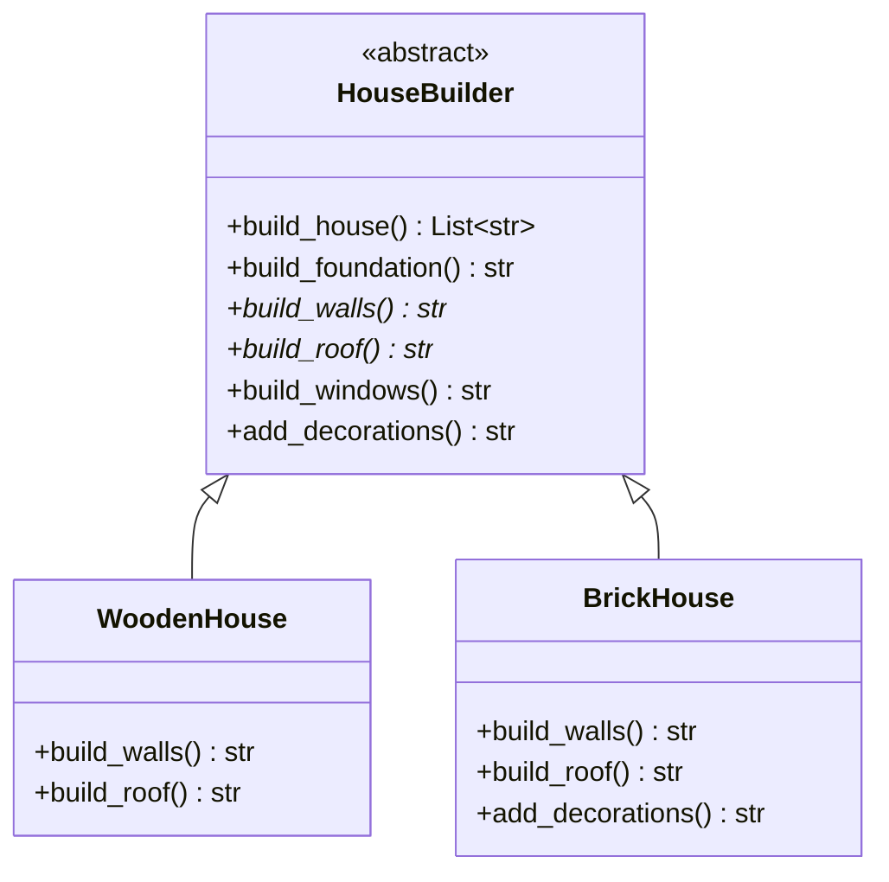

# Template Method Pattern

## Real-World Analogy
Consider building a house. Laying down a foundation, building walls, installing windows, and constructing a roof is a fixed sequence. A general construction company defines this process sequence. 

However, individual clients might want to build houses out of different materials: wood, brick, or steel. The construction template specifies the order of tasks, while the builder subclasses override specific tasks (like wall erection or roof styling) to customize the build.

---

## Mermaid UML Diagram

---

## Pros and Cons

| Pros | Cons |
| :--- | :--- |
| **Code Reuse**: Subclasses can reuse the base class's algorithms and default step implementations. | **Rigid Skeleton**: Some clients may feel restricted by the skeleton algorithm structure. |
| **Centralized Sequence Control**: Protects the core sequence of operations from being modified by subclasses. | **Liskov Substitution Violation**: Overriding a default step can break the logic sequence if not done carefully. |
| **Hooks**: Provides optional extension points for subclasses to inject custom logic. | |

---

## Performance and Concurrency Notes
- **Performance**: High efficiency. Uses standard inheritance lookup which has zero runtime cost.
- **Thread Safety**: Inherently thread-safe if subclasses do not maintain mutable instance-level or class-level state. The template method itself is stateless and delegates to methods in sequence.
