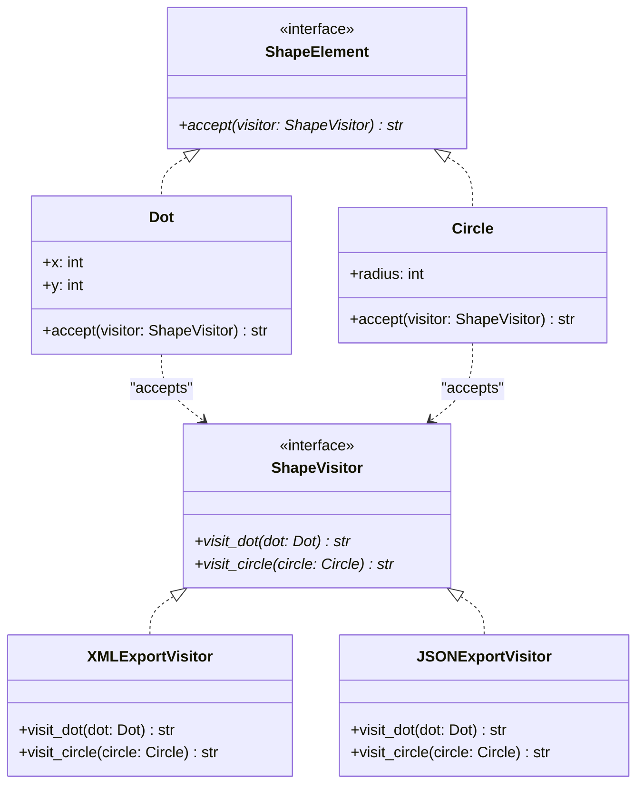

# Visitor Pattern

## Real-World Analogy
Consider a foreign tourist visiting a historic city (historic temples, museums, parks). The buildings and parks are the Elements, and the tourist is the Visitor. 

Each historic element (e.g. a museum or temple) has its own structural design. When the tourist visits them, they perform different actions (a tourist takes photos, reads descriptions, buys souvenirs). The sights do not change their structure; instead, the visitor executes custom behaviors depending on which sight they are visiting (double dispatch).

---

## Mermaid UML Diagram

---

## Pros and Cons

| Pros | Cons |
| :--- | :--- |
| **Open/Closed Principle**: You can introduce a new behavior (like a PNGExporterVisitor) that works with all existing shapes without changing the shape classes. | **Frequent Changes Break Visitors**: If you add a new Element subclass (e.g., Rectangle), you must update the Visitor interface and all its concrete implementations. |
| **Single Responsibility Principle**: Consolidates multiple variations of the same behavior (like export logic) into a single visitor class. | **Encapsulation Compromise**: Visitors may require access to the private state or helper fields of elements, violating encapsulation. |

---

## Performance and Concurrency Notes
- **Performance**: High efficiency. Employs double dispatch (calling `element.accept(visitor)` which in turn calls `visitor.visit_concrete_element(self)`). This is resolved via standard Python function lookups, which are extremely fast.
- **Thread Safety**: Concrete visitors are typically stateful if they accumulate analysis results (e.g., counting shapes or building export buffers). If multiple threads use the same visitor instance concurrently, protect the accumulator updates with a mutex lock to prevent data corruption.
