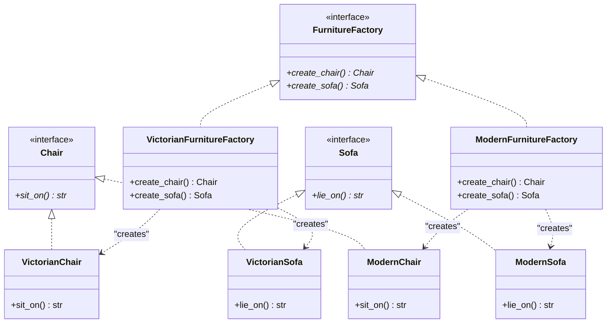

# Abstract Factory Pattern

## Real-World Analogy
Imagine a furniture store that sells furniture in matching styles: Victorian, Modern, and Art Deco. A customer buying furniture usually wants a matching set (e.g., matching Victorian chair and Victorian sofa). The Abstract Factory is like an automated furniture designer. Given a style requirement, it ensures that all produced items (Chairs, Sofas, Coffee Tables) belong to the same style family.

---

## Mermaid UML Diagram

---

## Pros and Cons

| Pros | Cons |
| :--- | :--- |
| **Product Compatibility**: Products created by the same factory are guaranteed to be compatible. | **Increased Complexity**: Requires defining many new classes and interfaces. |
| **Avoid Tighter Coupling**: Client code interacts with abstract interfaces rather than concrete implementations. | **Difficult Extension**: Adding a new product type (e.g., Table) requires modifying the abstract factory interface and all its concrete implementations. |
| **Single Responsibility Principle**: Consolidates product creation code. | |

---

## Performance and Concurrency Notes
- **Performance**: High efficiency. Since factories only compile configurations and instantiate simple classes, the overhead is negligible.
- **Thread Safety**: Concrete factories in this implementation are stateless and thus safe to be shared across threads.
