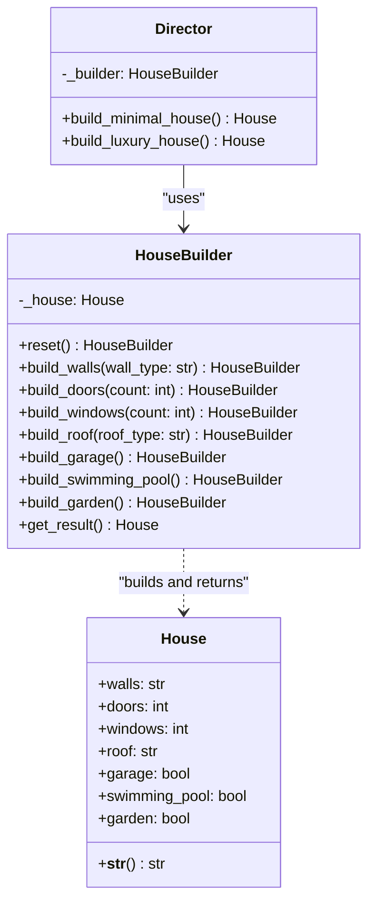

# Builder Pattern

## Real-World Analogy
Consider ordering a custom hamburger at a fast-food joint. The process of building a burger is step-by-step: choosing the bun type, adding a beef or veggie patty, adding cheese, lettuce, tomatoes, and sauces. A customer (the client) can choose to build a completely custom burger, or select a predefined menu option like a "Cheeseburger" or a "Veggie Delight" which is pre-assembled by the kitchen manager (the Director) using the same step-by-step assembly line (the Builder).

---

## Mermaid UML Diagram

---

## Pros and Cons

| Pros | Cons |
| :--- | :--- |
| **Step-by-Step Construction**: You can defer construction steps or run steps recursively. | **Increased Complexity**: Requires creating multiple new classes (Builder, Director, Product configurations). |
| **Object Immutability / Single Point of Build**: You can isolate complex construction code from business logic. | **Tight Coupling to Builder**: The resulting products must share a similar interface or lifecycle unless you separate the builders. |
| **Reuse Construction Code**: The same builder can construct different products based on steps executed. | |

---

## Performance and Concurrency Notes
- **Performance**: Negligible overhead. Chaining methods (fluent interface) returns references to the builder instance, which has very low memory allocations.
- **Thread Safety**: The builder instance maintains internal state (`self._house`). If multiple threads access the *same* builder instance concurrently to construct objects, race conditions will occur. Always instantiate a new builder per-thread or protect construction calls with a mutex lock if shared.
