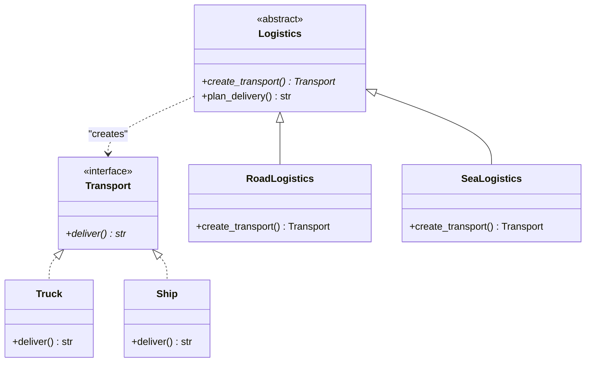

# Factory Method Pattern

## Real-World Analogy
Consider a logistics company. At first, the company only handles road freight using Trucks. When the business grows, sea freight is introduced. Instead of modifying the core application code to handle ships directly, the company defines a generic `Transport` interface. A `Logistics` base class declares a factory method for creating transports, and `RoadLogistics` and `SeaLogistics` subclasses override this method to return `Truck` and `Ship` respectively.

---

## Mermaid UML Diagram

---

## Pros and Cons

| Pros | Cons |
| :--- | :--- |
| **Open/Closed Principle**: You can introduce new types of products (e.g., AirLogistics) without breaking existing client code. | **Subclass Explosion**: The client must subclass the Creator class to instantiate specific concrete products. |
| **Single Responsibility Principle**: Instantiation code is moved to a single place, simplifying support. | **Complexity**: Introduces many new subclasses, which can make code more complex. |
| **Loose Coupling**: Eliminates direct binding of application code to concrete product classes. | |

---

## Performance and Concurrency Notes
- **Performance**: Very low overhead. Instantaneous object delegation. Subclass instantiation uses standard Python OOP.
- **Thread Safety**: The Factory Method itself has no state, so it is inherently thread-safe. Thread safety concerns only apply if the concrete products or creators hold mutable class-level or instance-level state.
