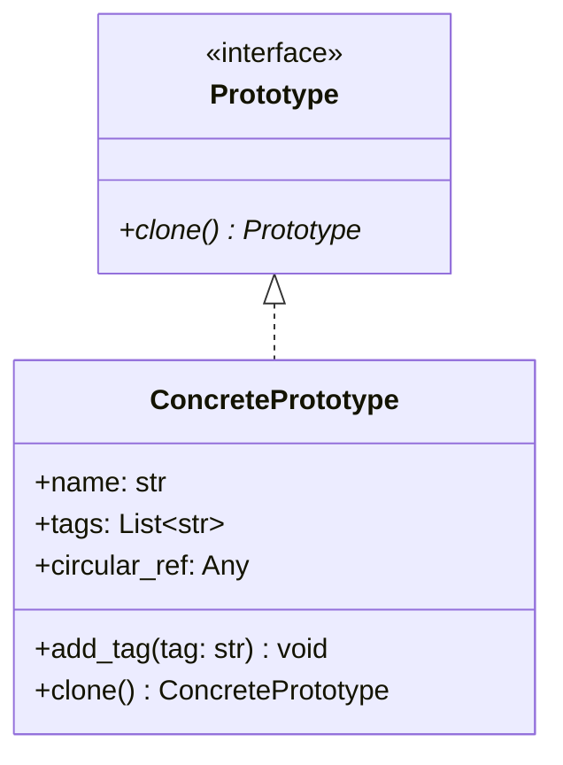

# Prototype Pattern

## Real-World Analogy
Consider cell division (mitosis). In mitosis, a cell splits into two identical cells. The original cell acts as a prototype. Rather than creating a brand-new cell structure from scratch (which would require executing a complex layout program), the biological system clones the existing cell structure, including its current state and DNA.

---

## Mermaid UML Diagram

---

## Pros and Cons

| Pros | Cons |
| :--- | :--- |
| **Independence**: You can clone objects without coupling to their concrete classes. | **Complex Object Copying**: Objects with complex structures or circular references can be challenging to clone correctly. |
| **Avoid Initialization Cost**: Speeds up object creation when instantiation is database- or resource-intensive. | **Hidden Copy Semantics**: Developers might call `clone()` expecting a shallow copy when a deep copy is executed, or vice-versa. |
| **Pre-configured States**: Reduces subclassing for creating variant state instances. | |

---

## Performance and Concurrency Notes
- **Performance**: In Python, `copy.deepcopy` utilizes serialization/memoization under the hood. While safe, it is slower than manual class instantiation. If performance is critical, you should implement a custom, field-by-field `clone` method instead of relying on `copy.deepcopy`.
- **Thread Safety**: Reading a prototype to clone it is thread-safe. However, if the prototype object is modified while another thread is cloning it, race conditions will occur. Use locks to synchronize modifications to shared prototype registries.
