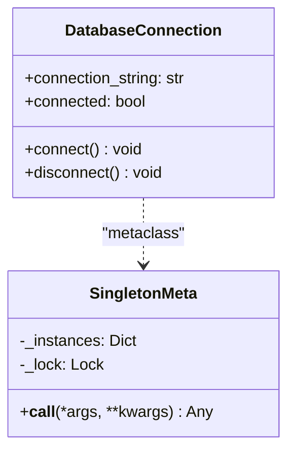

# Singleton Pattern

## Real-World Analogy
A country's government is a classic real-world analogy for a Singleton. A nation can only have one official government at any given time. Regardless of the individual members of the government, the administrative body represents a single point of authority and access for the country.

---

## Mermaid UML Diagram

---

## Pros and Cons

| Pros | Cons |
| :--- | :--- |
| **Controlled Access**: Solves the problem of accessing single resources (e.g., db connections, configuration pools). | **Global State**: Introduces global state into the application, making components tightly coupled. |
| **Lazy Initialization**: The instance is only created when it is requested for the first time. | **Testing Difficulty**: Mocking singleton classes during unit testing can be difficult. |
| **Thread Safe**: Double-checked locking guarantees only one instance even in multi-threaded code. | **Violation of SRP**: The Singleton class handles both its business logic and its instantiation lifecycle. |

---

## Performance and Concurrency Notes
- **Concurrency**: This implementation uses double-checked locking inside the metaclass `__call__` method. This ensures that locking overhead is only incurred when the instance is first created. Subsequent calls read directly from `_instances` memory, avoiding expensive thread synchronizations.
- **Garbage Collection**: Because the metaclass retains a hard reference to the instance in `_instances`, the singleton object will persist for the application's entire lifetime unless manually deleted.
