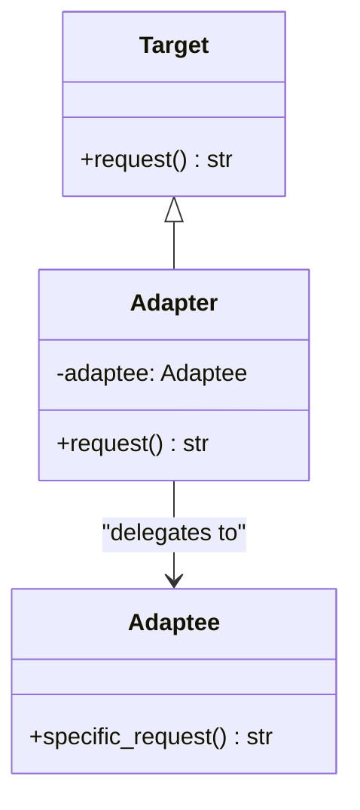

# Adapter Pattern

## Real-World Analogy
Think of a travel plug adapter. If you travel from the US to the UK, you cannot plug your US laptop power adapter directly into the UK wall outlet because the physical pins are different. You plug your US power supply into a UK travel adapter (the Adapter), which translates the physical interface so it can plug into the UK wall socket (the Adaptee).

---

## Mermaid UML Diagram

---

## Pros and Cons

| Pros | Cons |
| :--- | :--- |
| **Single Responsibility Principle**: You can separate the interface or data conversion code from the primary business logic. | **Complexity**: Increases overall complexity because you have to introduce new interfaces and adapter classes. |
| **Open/Closed Principle**: You can introduce new adapters into the program without breaking existing client code. | |

---

## Performance and Concurrency Notes
- **Performance**: High efficiency, but adds a tiny layer of delegation overhead (an extra method call and string/data conversion). If the translation logic (e.g. JSON-to-XML conversion) is heavy, cache the results if applicable.
- **Thread Safety**: This implementation is stateless (except for wrapping the `adaptee`). If multiple threads access the same adapter instance, it is safe as long as the underlying `adaptee` is thread-safe.
