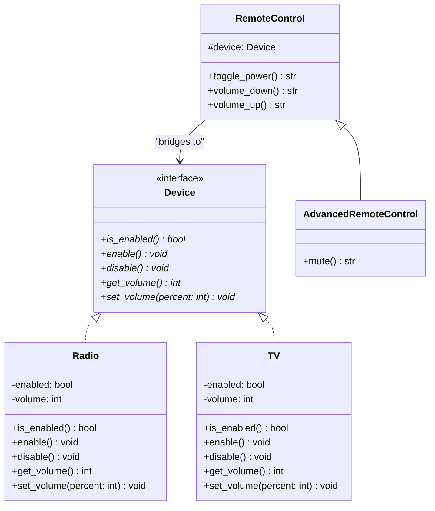

# Bridge Pattern

## Real-World Analogy
Consider a TV and a remote control. The TV is the implementation, and the remote control is the abstraction. You can use the remote control to interact with any brand of TV as long as both implement their respective interfaces. You can upgrade the remote control (e.g., adding a mute button or voice controls) without changing the TV hardware, and you can switch TVs (from TV to Radio or a different brand) without needing a completely new set of remote controls.

---

## Mermaid UML Diagram

---

## Pros and Cons

| Pros | Cons |
| :--- | :--- |
| **Orthogonal Extension**: You can extend abstractions and implementations independently. | **Complex Architecture**: Makes the code structure more complex by splitting classes into two separate hierarchies. |
| **Hide Implementation Details**: Client code is completely decoupled from the actual device/implementation details. | |
| **Open/Closed Principle**: You can introduce new devices (like a Projector) or new remotes without altering each other. | |

---

## Performance and Concurrency Notes
- **Performance**: Introduces a minor delegation call (indirect method lookup through the bridge instance variable). This has virtually zero impact in Python.
- **Thread Safety**: This pattern does not manage thread synchronization itself. If multiple threads share a `RemoteControl` pointing to the same `Device`, mutators (like changing the volume) will cause race conditions unless synchronized with a `threading.Lock`.
