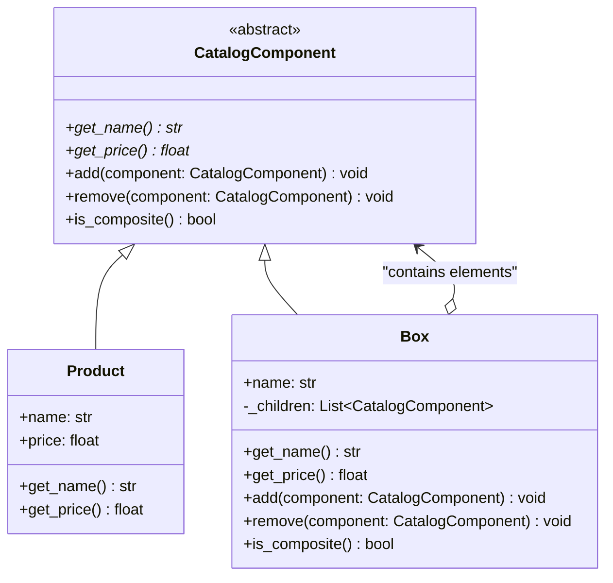

# Composite Pattern

## Real-World Analogy
Consider a shipping order. A large delivery box (the Composite) can contain smaller item packages, bubble wrap, and individual products (the Leaves). The smaller packages can themselves contain products or even smaller boxes. If you want to calculate the total price of the order, you don't need to manually unpack every box; you just ask the outermost box for its price, and it recursively asks all its contents to sum up their prices.

---

## Mermaid UML Diagram

---

## Pros and Cons

| Pros | Cons |
| :--- | :--- |
| **Polymorphism / Uniform Interface**: You can work with complex tree structures more conveniently. Client code treats leaves and composites identically. | **Overgeneralized Design**: It can be difficult to restrict components inside a composite. For example, ensuring a `Box` only accepts certain items can require runtime type checks. |
| **Open/Closed Principle**: You can introduce new product types or structural components without breaking existing client code. | |

---

## Performance and Concurrency Notes
- **Performance**: Operations on composite structures (like tree traversals) can become slow if the tree is extremely deep. Consider caching the results of expensive traversals (like the total price or size) if the tree structure doesn't change frequently.
- **Thread Safety**: Modifying the tree structure (adding or removing elements) while another thread is reading/iterating through it will raise a `RuntimeError` (due to size changes during iteration). Protect structure modifications with a lock or use snapshot copies.
