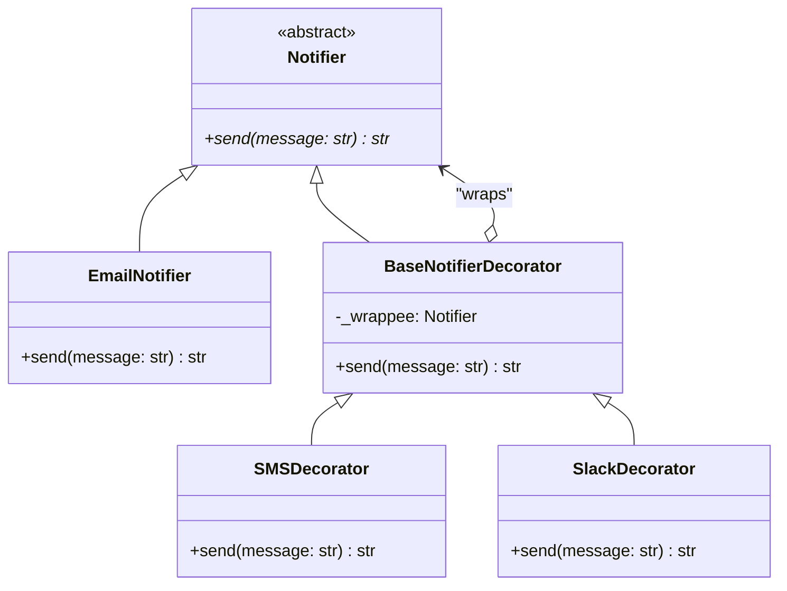

# Decorator Pattern

## Real-World Analogy
Consider wearing clothes. When you are cold, you wear a T-shirt. If it starts to rain, you put on a sweater over the T-shirt. If it gets windy, you put on a jacket over the sweater. All these clothes "decorate" your basic state (being dressed) and add functionality (warmth, windproofing, waterproofing) without changing your core identity. You can take them off or combine them as needed.

---

## Mermaid UML Diagram

---

## Pros and Cons

| Pros | Cons |
| :--- | :--- |
| **Dynamic Extensions**: You can extend an object's behavior dynamically at runtime without creating a large inheritance structure. | **Hard to Remove Decorators**: It is difficult to remove a specific decorator from the middle of the wrapper stack. |
| **Combined Behaviors**: You can combine several behaviors by wrapping an object in multiple decorators. | **Many Small Classes**: Leads to codebases with many small, simple classes that can be hard to navigate. |
| **Single Responsibility Principle**: You can divide a monolithic class that implements all possible variants of behavior into separate, focused decorators. | **Instantiation Complexity**: The initialization code for deeply wrapped components can look convoluted. |

---

## Performance and Concurrency Notes
- **Performance**: Very fast. However, if there are dozens of nested decorators, the call stack depth increases, causing slight performance degradation due to nested function call overhead.
- **Thread Safety**: Inherits the thread-safety profile of the underlying component. Since decorators usually store their state inside local function scopes or delegate downstream, they are thread-safe if the wrapped objects themselves are thread-safe and state modifications are locked.
