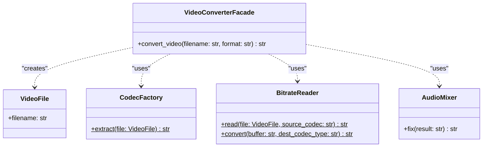

# Facade Pattern

## Real-World Analogy
Consider ordering a product from a catalog by phone. When you call the company, an operator (the Facade) handles your entire order. Behind the scenes, the operator talks to the warehouse to check stock, calls the credit card processing center to authorize payment, and requests the shipping department to prepare and mail the package. As a customer, you do not interact with all these subsystems directly; you only talk to the operator.

---

## Mermaid UML Diagram

---

## Pros and Cons

| Pros | Cons |
| :--- | :--- |
| **Isolate Complexity**: You can isolate your client code from the complexities of a large subsystem. | **God Object Risk**: A facade can easily become a "god object" coupled to all classes of an app. |
| **Simplified Entry Point**: Provides a single, clear interface to a complex set of classes or tools. | |

---

## Performance and Concurrency Notes
- **Performance**: High performance. The facade simply delegates calls. It does not introduce any noticeable memory or computational overhead.
- **Thread Safety**: Inherently thread-safe if the underlying subsystem is thread-safe or if the facade itself remains stateless. If the facade manages state (e.g. tracking multiple conversions in progress), it must synchronize access using `threading.Lock`.
