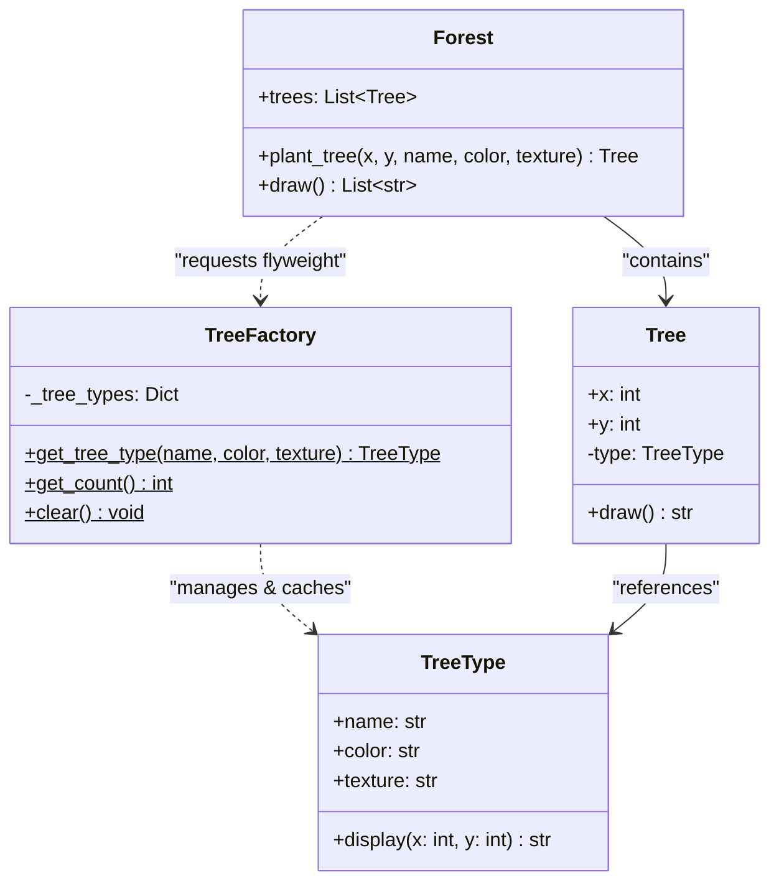

# Flyweight Pattern

## Real-World Analogy
Imagine a computer game rendering a vast forest of 1,000,000 trees. If every tree holds its own textures, 3D mesh model, leaf colors, bark patterns, and coordinate fields (`x`, `y`), the game would consume gigabytes of RAM. 

Instead, the game defines a `TreeType` flyweight containing the heavy model data (mesh, texture, default colors) and shares a single instance of `TreeType` across all trees. Each individual `Tree` (the Context) only stores its unique coordinate fields (`x`, `y`) and references the shared `TreeType` object.

---

## Mermaid UML Diagram

---

## Pros and Cons

| Pros | Cons |
| :--- | :--- |
| **Enormous Memory Savings**: Dramatically reduces memory usage when working with millions of small objects. | **Complex State Management**: You must split objects into intrinsic (shared) and extrinsic (unique) states, complicating logic. |
| **Object Sharing**: Centralizes the management of shared components. | **CPU Tradeoff**: May trade memory capacity for CPU cycles if extrinsic state values have to be calculated on the fly. |

---

## Performance and Concurrency Notes
- **Performance**: High performance under heavy load. The cache registry search overhead is very low.
- **Thread Safety**: Accessing the `TreeFactory` registry is NOT thread-safe in this basic implementation. If multiple threads concurrently plant trees, race conditions can cause duplicate `TreeType` creations. To prevent this, protect the factory's `get_tree_type` method using a thread lock (`threading.Lock`).
- **Garbage Collection**: Because the factory holds hard references in `_tree_types` cache, flyweights will never be garbage collected unless they are explicitly cleared.
