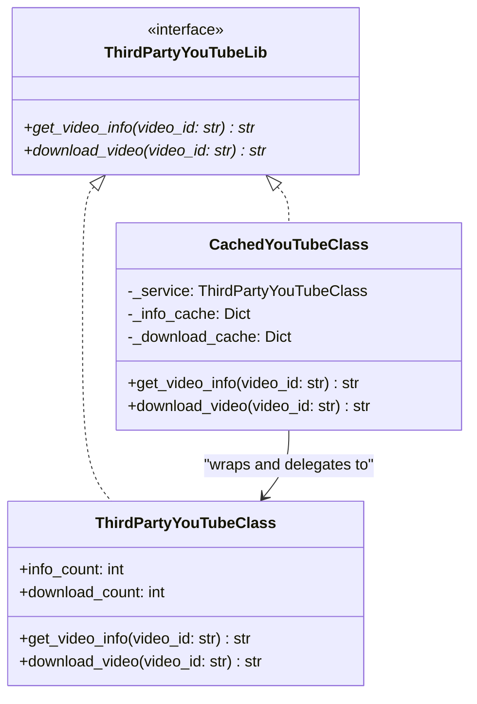

# Proxy Pattern

## Real-World Analogy
Consider a credit card. A credit card is a proxy for a bank account (which holds actual physical cash). It implements the same interface (allows paying for purchases) but controls access to the cash (checks credit limit, authorizes PIN, blocks suspicious payments) and performs transactions securely. You do not have to carry around bundles of cash; you use the credit card proxy instead.

---

## Mermaid UML Diagram

---

## Pros and Cons

| Pros | Cons |
| :--- | :--- |
| **Access Control & Lifecycle Management**: You can manage the lifecycle of a heavy service object without clients knowing. | **Added Latency**: If the proxy doesn't cache or bypasses decisions, it introduces an extra layer of indirection. |
| **Lazy Initialization**: The service object can be instantiated only when it is actually needed (Virtual Proxy). | **Increased Complexity**: Requires defining new classes and matching service interfaces. |
| **Security & Logging**: Provides a hook to check credentials, write audit logs, or validate request arguments before calling the service. | |

---

## Performance and Concurrency Notes
- **Performance**: High efficiency. Under high-load caching scenarios (e.g. caching web API responses), the proxy drastically reduces downstream network latency and API usage costs.
- **Thread Safety**: The cache dictionary (`self._info_cache`) is not thread-safe. If multiple threads access the proxy simultaneously, race conditions can cause duplicate downloads. In concurrent environments, synchronize cache reads/writes using `threading.Lock`.
