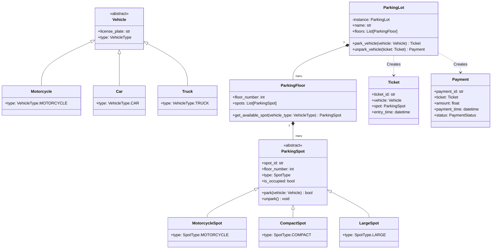

# LLD Project: Parking Lot System

A Low-Level Design of an interview-grade, thread-safe **Parking Lot System** in Python, wrapped with a FastAPI web interface.

---

## 1. System Requirements

1. **Multiple Vehicle Types**: Support for Motorcycles, Cars, and Trucks.
2. **Multiple Spot Types**: Motorcycle spots, Compact spots (for cars), and Large spots (for trucks).
3. **Multiple Floors**: The parking lot contains multiple floors, each with its own set of spots.
4. **Spot Allocation Strategy**: Automatically allocate the nearest available spot of the correct type to the vehicle (Nearest-to-Entrance Strategy).
5. **Pricing Strategy**: Dynamic calculation of fees based on duration and vehicle type (e.g., flat rate first hour, then hourly rate).
6. **Thread-Safety**: Concurrency control when multiple entry/exit gates attempt to book spots simultaneously.
7. **FastAPI Web API**: Web interface showing real-world application of domain entities, services, and endpoints.

---

## 2. Class Diagram (UML)

---

## 3. Concurrency Design

When multiple cars try to enter different gates simultaneously, there is a risk of a race condition: two gates might see the same spot as vacant and assign it to different vehicles.
- **Solution**: We implement **Thread-Safety** in Python using `threading.Lock`. The `ParkingLotService` wraps all spot assignment operations inside a thread-safe context, protecting the shared state of `ParkingFloor` spots.

---

## 4. API Endpoints (FastAPI)

- `POST /parking-lot/init`: Initialize a parking lot with customized floors and spots.
- `POST /park`: Park a vehicle and receive a ticket.
- `POST /unpark`: Unpark a vehicle by providing a ticket ID, calculating the payment fee.
- `GET /status`: View current occupancy rates per floor and spot type.
