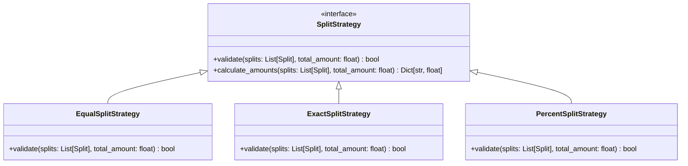

# LLD Project: Splitwise (Expense Sharing System)

A Low-Level Design of a production-grade **Splitwise-like Expense Sharing System** in Python, wrapped with a FastAPI interface.

---

## 1. System Requirements

1. **User Management**: Support adding users with name, email, and user ID.
2. **Group Management**: Support adding users to named groups.
3. **Expense split types**: Support three distinct split strategies:
   - **Equal Split**: Expense split equally among participants.
   - **Exact Split**: Specific monetary values declared for each participant (must sum to total expense).
   - **Percentage Split**: Specific percentages declared for each participant (must sum to 100%).
4. **Debt Simplification Algorithm**: Minimize the number of transactions to settle debts (Min-Flow Cash Flow optimization).
5. **FastAPI Web API**: Manage groups, bills, and get simplified payment routes.

---

## 2. Design Patterns Used

### Strategy Pattern
We encapsulate the splitting validation and distribution mathematics within specific `SplitStrategy` objects. This allows the system to easily add new payment splits (like shares or weights) without modifying the core `Expense` engine.

---

## 3. Debt Simplification Algorithm (Min-Flow Cash Flow)

If User A owes User B $10, and User B owes User C $10, it's simpler for User A to pay User C $10 directly.
- **Algorithm**:
  1. Calculate the net balance of each user (`credit` - `debit`).
  2. Separate users into two lists: debtors (net balance < 0) and creditors (net balance > 0).
  3. Greedily match the largest debtor with the largest creditor. Settle the maximum possible amount.
  4. Repeat until all balances are settled (net balance is 0).

---

## 4. API Endpoints (FastAPI)

- `POST /users`: Register a new user.
- `POST /groups`: Create an expense group.
- `POST /groups/{group_id}/members`: Add members to a group.
- `POST /expenses`: Create an expense in a group using a specified split type.
- `GET /groups/{group_id}/balances`: Get the raw user balances inside a group.
- `GET /groups/{group_id}/simplify`: Get the simplified list of transactions to settle the group.
