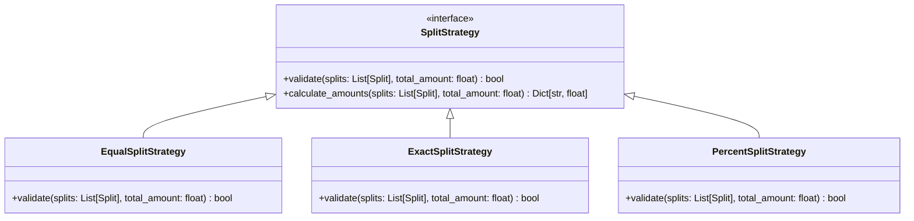

# 💸 LLD Project: Splitwise (Expense Sharing & Debt Simplification)

A production-grade, interview-ready **Low-Level Design (LLD)** of an **Expense Sharing System** (Splitwise-like) in Python, featuring extensible split strategies and a greedy debt-simplification algorithm.

---

## 🧭 System Requirements

1. **User & Group Management**: Add users and organize them into distinct expense groups.
2. **Extensible Split Strategies**: Support three distinct split models:
   - **Equal Split**: Costs divided evenly among all participants.
   - **Exact Split**: Specific currency values assigned to each participant (validated to sum to the total bill).
   - **Percentage Split**: Specific percentage shares assigned to each participant (validated to sum to 100%).
3. **Debt Simplification**: Automatically minimize the total number of transactions required to settle all debts (Greedy Min-Flow Cash Flow algorithm).
4. **FastAPI Web API**: Real-world endpoints to manage transactions, query balances, and fetch simplified payment paths.

---

## 🧩 Design Patterns: Strategy Pattern

The validation and calculation of splits are encapsulated within independent `SplitStrategy` objects. This allows the system to easily support new allocation models (e.g. shares, weights) without modifying the core `Expense` class.

---

## 🧮 Debt Simplification Algorithm (Min-Flow Cash Flow)

Without simplification, a chain of debts results in excessive transactions. If **A owes B \$10** and **B owes C \$10**, the algorithm simplifies this so **A pays C \$10** directly.

### Step-by-Step Execution:
1. **Net Balance Calculation**: For each group member, calculate their net balance (`Total Credited - Total Debited`).
2. **Classify Members**: Split members into two sorted lists:
   - **Debtors** (Net balance < 0): Sorted ascending (most negative first).
   - **Creditors** (Net balance > 0): Sorted descending (most positive first).
3. **Greedy Matching**: Match the largest debtor with the largest creditor. Settle the maximum possible amount, update their balances, and repeat until all balances are zero.

---

## 🔌 REST API Endpoints (FastAPI)

| Method | Endpoint | Description | Payloads / Parameters |
| :---: | :--- | :--- | :--- |
| `POST` | `/users` | Register a new user in the system | `user_id`, `name`, `email` |
| `POST` | `/groups` | Create a new expense group | `group_id`, `name` |
| `POST` | `/groups/{group_id}/members` | Add a registered user to an expense group | `user_id` |
| `POST` | `/groups/{group_id}/expenses` | Log an expense in a group with a split strategy | `description`, `total_amount`, `paid_by`, `split_type`, `splits` |
| `GET` | `/groups/{group_id}/balances` | Get raw balances (who owes how much) | None |
| `GET` | `/groups/{group_id}/simplify` | Get the simplified, optimal settlement transaction path | None |
