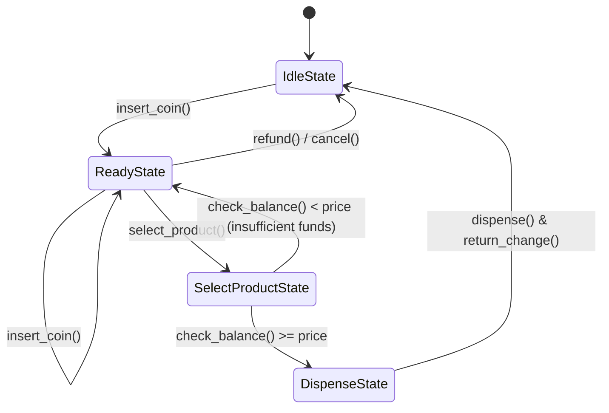
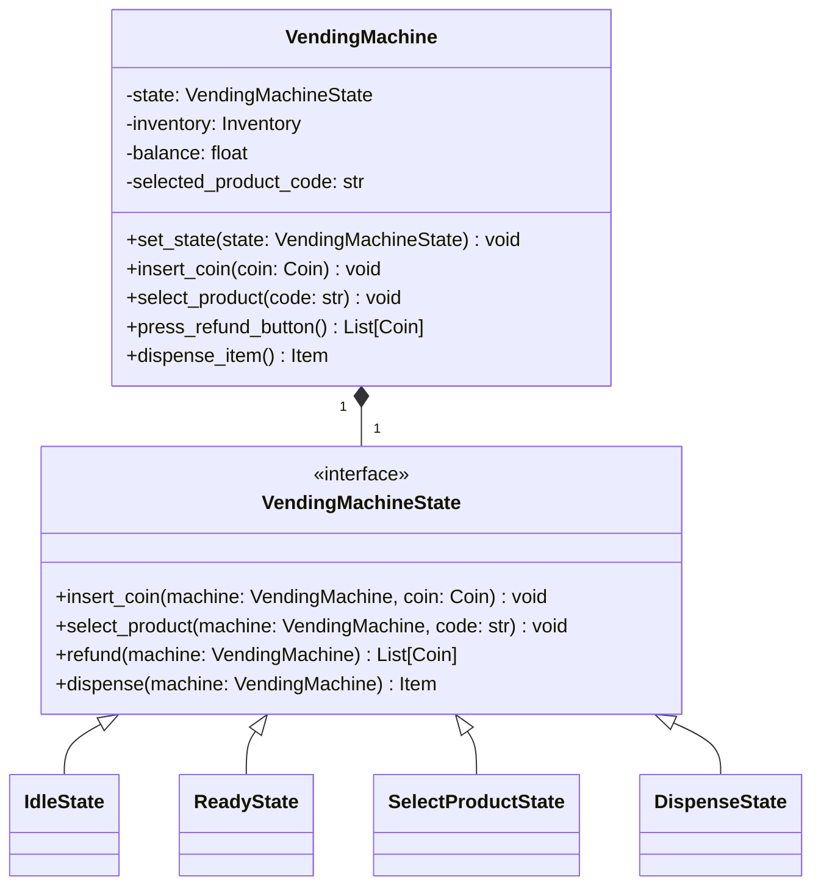

# LLD Project: Vending Machine System

A Low-Level Design of a standard **Vending Machine System** using the **State Design Pattern** in Python, wrapped in a FastAPI web interface.

---

## 1. System Requirements

1. **State Machine Transitions**: Implement a clean state machine handling:
   - **IdleState**: Initial state, waiting for coin insertion.
   - **ReadyState**: Coin inserted, waiting for product selection or additional coins.
   - **SelectProductState**: Product selected, checking price vs balance, dispensing.
   - **DispenseState**: Item dispensed, calculating refund/change, returning to IdleState.
2. **Product Inventory**: Track product items (Soda, Chips, Candy) with code, price, and inventory count.
3. **Coin Handling**: Accept physical denominations (Nickels, Dimes, Quarters, Dollars).
4. **Refund/Cancel**: Allow users to cancel at any time, returning inserted money.
5. **FastAPI Web API**: Web interface simulating coin insertion, selection, cancelation, and dispensing.

---

## 2. Design Patterns Used

### State Pattern
The State Pattern allows an object to alter its behavior when its internal state changes. The object will appear to change its class. Instead of managing state using long `if-else` conditionals inside the context, we delegate behaviors to concrete `VendingMachineState` subclasses.

### UML Class Diagram

