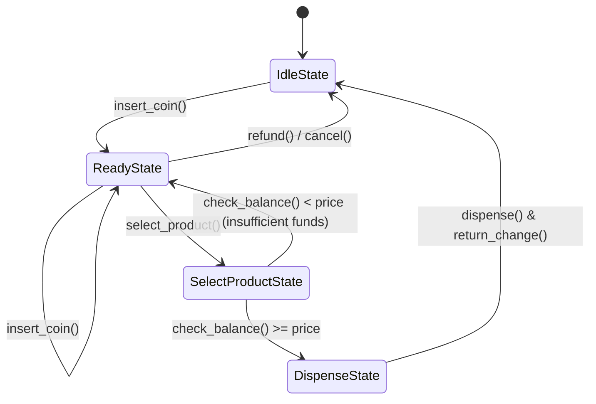
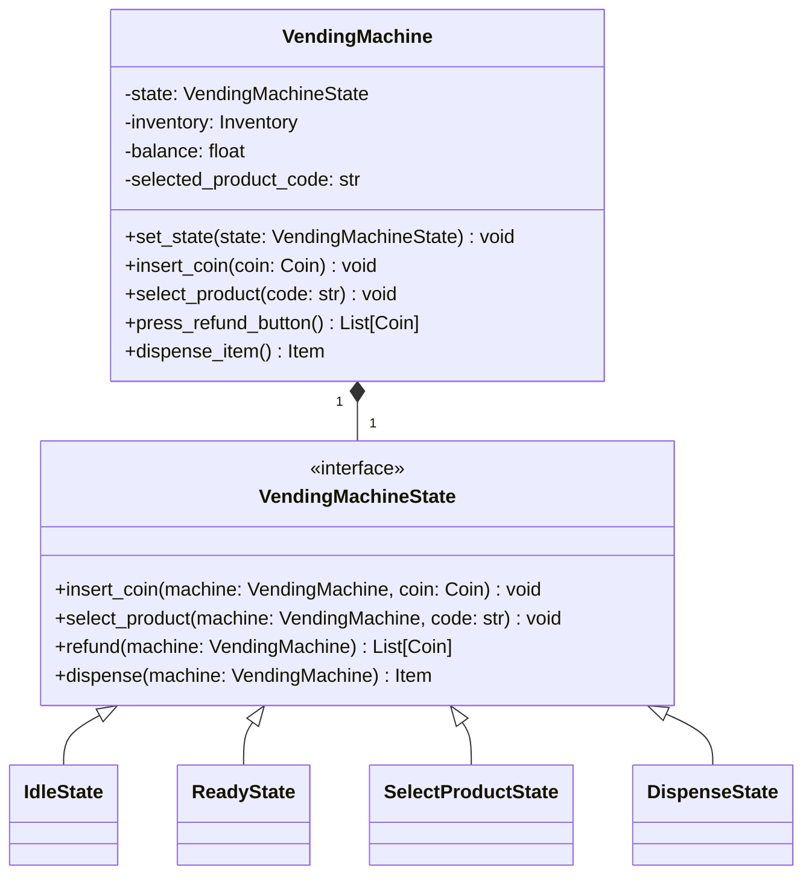

# 🪙 LLD Project: State Pattern Vending Machine System

A production-grade, interview-ready **Low-Level Design (LLD)** of a **Vending Machine System** in Python utilizing the **State Design Pattern** and exposed via **FastAPI**.

---

## 🧭 System Requirements

1. **State-Driven Workflow**: Implement a clean state machine handling:
   - **IdleState**: Initial state, waiting for coin insertion.
   - **ReadyState**: Balance loaded, waiting for product selection or further coins.
   - **SelectProductState**: Product selected, evaluating cost vs. balance.
   - **DispenseState**: Item dispensed, change returned, resetting state.
2. **Product Inventory**: Track product items (e.g. Soda, Chips, Candy) with unique codes, prices, and stock quantities.
3. **Coin Handling**: Accept physical currency denominations (Nickels, Dimes, Quarters, Dollars).
4. **Refund/Cancelation**: Allow users to cancel the transaction at any time, returning all inserted coins.
5. **FastAPI Web API**: Endpoints simulating physical interactions (coin insertion, product selection, refund requests, dispensing).

---

## 🔄 State Machine Transition Diagram

---

## 🧩 Design Patterns: State Pattern

The State Pattern allows the `VendingMachine` to alter its behavior dynamically when its internal state changes. Instead of managing state transitions using nested conditional blocks (`if-else`), behavior is delegated to concrete `VendingMachineState` subclasses.

---

## 🔌 REST API Endpoints (FastAPI)

| Method | Endpoint | Description | Payloads / Parameters |
| :---: | :--- | :--- | :--- |
| `POST` | `/inventory/init` | Load inventory stock and reset machine state | `items` list |
| `POST` | `/insert-coin` | Insert a coin into the machine (increments balance) | `coin` (float value) |
| `POST` | `/select-product` | Select an item by code (evaluates balance) | `code` (string) |
| `POST` | `/dispense` | Dispense the selected item and return any change due | None |
| `POST` | `/refund` | Cancel transaction and return all inserted balance | None |
| `GET` | `/status` | Retrieve real-time inventory count and balance | None |
