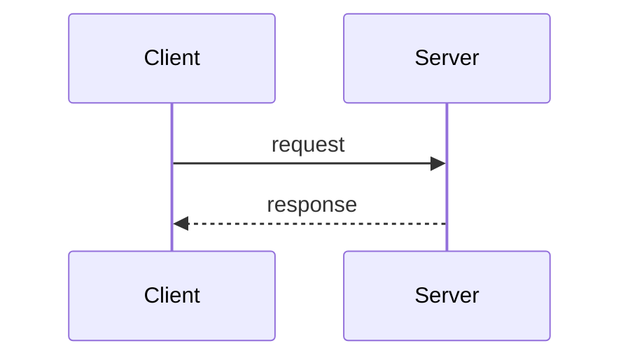
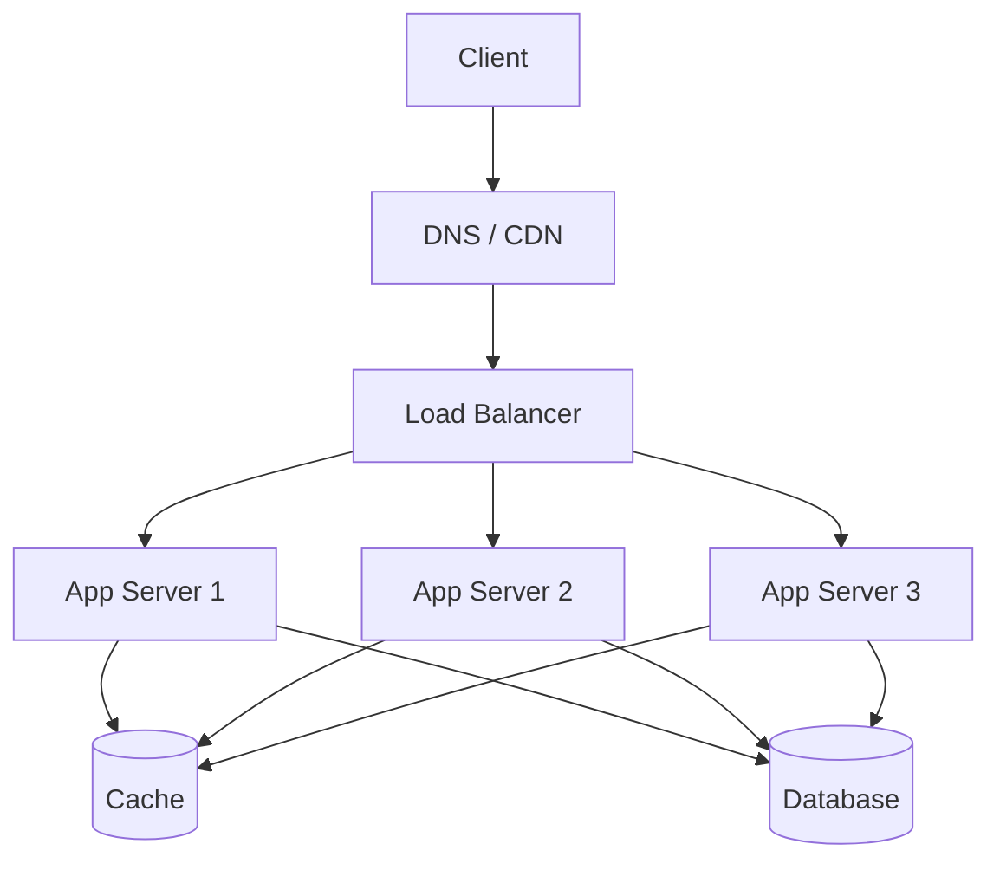

# Day 02 — System Design Basics

> Core vocabulary and building blocks. Everything in later days is a
> combination of the pieces introduced here.

---

## 1. Client–Server model

The foundation of almost every system:

- **Client**: requests resources (browser, mobile app, another service).
- **Server**: provides resources/processing.
- Communication usually over **HTTP/HTTPS** on top of **TCP/IP**.

A *request* contains a method, path, headers, and optional body. A *response*
contains a status code, headers, and body.

---

## 2. The journey of a request (what happens when you type a URL)

1. **DNS lookup** — domain name → IP address.
2. **TCP handshake** — establish connection (SYN, SYN-ACK, ACK).
3. **TLS handshake** — if HTTPS, negotiate encryption.
4. **HTTP request** sent to the server (often hits a **load balancer** first).
5. Load balancer routes to an **application server**.
6. Server may hit a **cache**, **database**, or other **services**.
7. **Response** travels back; browser renders it.

Each hop is a place to add latency, caching, or failure handling.

---

## 3. Core building blocks (the vocabulary)

| Block | Purpose |
|-------|---------|
| **DNS** | Maps domain → IP |
| **Load Balancer** | Distributes traffic across servers |
| **Application Server** | Runs business logic |
| **Database** | Persistent storage of truth |
| **Cache** | Fast, temporary storage of hot data |
| **CDN** | Serves static content from edge locations |
| **Message Queue** | Async communication / decoupling |
| **Blob/Object Store** | Stores files, images, videos |

A typical web architecture:

---

## 4. Vertical vs Horizontal scaling (intro — deep dive Day 07)

- **Vertical (scale up)**: bigger machine (more CPU/RAM). Simple, but a hard
  ceiling and a single point of failure.
- **Horizontal (scale out)**: more machines. Near-unlimited but needs load
  balancing, statelessness, and distributed-systems thinking.

---

## 5. Stateless vs Stateful services

- **Stateless**: server keeps no client session data between requests. Any
  server can handle any request → easy to scale horizontally. (Store state in a
  shared cache/DB instead.)
- **Stateful**: server remembers client state (e.g., in-memory session). Harder
  to scale; requires sticky sessions or state replication.

> **Rule of thumb:** Push state out of app servers into Redis/DB so app servers
> stay stateless and disposable.

---

## 6. Latency vs Throughput

- **Latency** — time for a single operation (ms). "How fast is one request?"
- **Throughput** — operations per unit time (QPS/RPS). "How many at once?"

They trade off: batching improves throughput but can hurt latency. Optimize for
the one that matters to your use case (usually **latency** for user-facing).

---

## 7. Proxies

- **Forward proxy** — sits in front of *clients*; hides client identity
  (e.g., corporate proxy, VPN).
- **Reverse proxy** — sits in front of *servers*; hides server topology, does
  SSL termination, caching, load balancing (e.g., Nginx, HAProxy).

---

## 8. APIs — the contract

- **REST** — resources + HTTP verbs (GET/POST/PUT/DELETE), stateless, cacheable.
- **GraphQL** — single endpoint, client specifies exactly what data it needs.
- **gRPC** — binary (Protobuf) over HTTP/2, fast, great for service-to-service.

| | REST | GraphQL | gRPC |
|-|------|---------|------|
| Format | JSON | JSON | Protobuf (binary) |
| Best for | Public APIs | Flexible clients | Internal microservices |
| Over-fetching | Common | Avoided | N/A |

---

## 9. Key metrics & percentiles

- **p50 (median)**, **p95**, **p99** latency — the tail matters: p99 is what
  your unhappiest 1% of users feel.
- **QPS / RPS** — load.
- **Error rate**, **saturation** (how full the system is).

> **Key takeaway:** Learn the boxes (LB, app, cache, DB, queue, CDN) and the
> arrows (DNS → TLS → HTTP). Keep services **stateless**, optimize the right
> metric (latency vs throughput), and remember the tail (p99).
