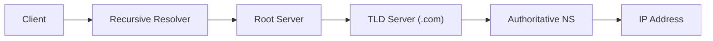

# Day 03 — Networking Fundamentals

> How machines actually talk to each other. You don't need to be a network
> engineer, but a system designer must understand DNS, TCP/IP, HTTP, and TLS.

---

## 1. The OSI & TCP/IP models

| OSI Layer | TCP/IP Layer | Examples |
|-----------|--------------|----------|
| 7 Application | Application | HTTP, DNS, SMTP, gRPC |
| 6 Presentation | Application | TLS/SSL, encoding |
| 5 Session | Application | sessions |
| 4 Transport | Transport | **TCP, UDP** |
| 3 Network | Internet | **IP, ICMP** |
| 2 Data Link | Link | Ethernet, MAC |
| 1 Physical | Link | cables, radio |

You mostly operate at **L4 (TCP/UDP)** and **L7 (HTTP)** — these also name the
two main load-balancer types (Day 07).

---

## 2. IP addressing

- **IPv4**: 32-bit, e.g. `192.168.1.1` (~4.3B addresses, exhausted).
- **IPv6**: 128-bit, e.g. `2001:db8::1` (effectively unlimited).
- **Private ranges** (not routable on internet): `10.0.0.0/8`,
  `172.16.0.0/12`, `192.168.0.0/16`.
- **Ports**: 0–65535. Well-known: 80 (HTTP), 443 (HTTPS), 22 (SSH), 53 (DNS).

---

## 3. TCP vs UDP

| | TCP | UDP |
|-|-----|-----|
| Connection | Connection-oriented | Connectionless |
| Reliability | Guaranteed, ordered, retransmits | Best-effort, may drop/reorder |
| Overhead | Higher | Lower |
| Use cases | Web, APIs, DB, file transfer | Video/voice, gaming, DNS |

**TCP 3-way handshake:** `SYN → SYN-ACK → ACK` (then data flows).

> Choose **UDP** when speed matters more than perfect delivery (live streaming),
> **TCP** when correctness matters (almost everything else).

---

## 4. DNS — the internet's phonebook

Resolves `example.com` → `93.184.216.34`.

**Resolution flow (recursive):**

**Common record types:**

| Record | Meaning |
|--------|---------|
| **A** | Domain → IPv4 |
| **AAAA** | Domain → IPv6 |
| **CNAME** | Alias → another domain |
| **MX** | Mail server |
| **NS** | Name server |
| **TXT** | Arbitrary text (SPF, verification) |

- **TTL** controls caching duration of a record.
- DNS can do **load balancing** (round-robin, geo-routing) — first layer of
  traffic distribution.

---

## 5. HTTP — the application protocol

**Request = method + URL + headers + body. Response = status + headers + body.**

**Methods:**

| Method | Use | Idempotent? | Safe? |
|--------|-----|-------------|-------|
| GET | Read | Yes | Yes |
| POST | Create | No | No |
| PUT | Replace | Yes | No |
| PATCH | Partial update | No | No |
| DELETE | Remove | Yes | No |

**Status codes:**

- `1xx` informational
- `2xx` success (200 OK, 201 Created, 204 No Content)
- `3xx` redirection (301 permanent, 302 temporary, 304 Not Modified)
- `4xx` client error (400, 401 Unauthorized, 403 Forbidden, 404, 429 Too Many Requests)
- `5xx` server error (500, 502 Bad Gateway, 503 Unavailable, 504 Timeout)

**HTTP versions:**

- **1.1** — text, one request per connection (with keep-alive).
- **2** — binary, multiplexing over one connection, header compression.
- **3 (QUIC)** — runs over **UDP**, avoids head-of-line blocking, faster handshakes.

---

## 6. HTTPS & TLS

- **TLS** encrypts traffic and authenticates the server (via certificates).
- **Handshake (simplified):** client hello → server cert → key exchange →
  symmetric session key → encrypted data.
- **Certificate Authorities (CAs)** sign certs; browser trust chains validate.
- TLS termination is often done at the **load balancer / reverse proxy**.

---

## 7. Communication patterns

- **Polling** — client repeatedly asks "any update?" (simple, wasteful).
- **Long polling** — server holds request open until data is ready.
- **WebSockets** — full-duplex persistent connection (chat, live feeds).
- **Server-Sent Events (SSE)** — server → client stream over HTTP (one-way).
- **Webhooks** — server → server callback when an event happens.

| Need | Use |
|------|-----|
| Real-time, two-way | WebSockets |
| Server push, one-way | SSE |
| Occasional updates | Long polling |
| Event notification between services | Webhooks |

---

## 8. CDN & edge (preview of Day 13)

A **Content Delivery Network** caches content at **edge locations** close to
users, reducing latency and origin load. Networking-wise it relies on
**Anycast** routing to send users to the nearest edge.

---

> **Key takeaway:** Requests ride **IP → TCP/UDP → TLS → HTTP**. Know DNS
> resolution, TCP vs UDP, HTTP methods/status codes, and the real-time options
> (WebSocket/SSE/long-poll). These choices shape latency and reliability.
