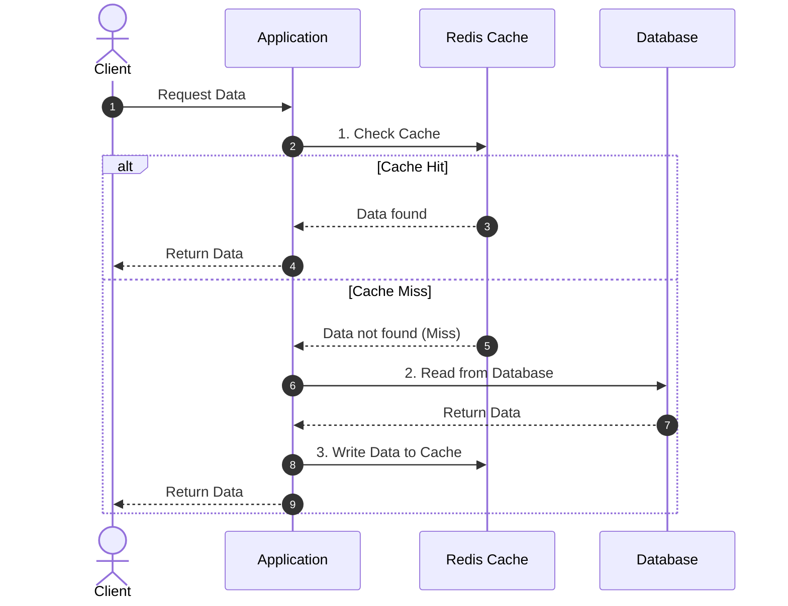

# Day 05 — Caching Basics

> Caching is the single most effective way to make systems faster and cheaper.
> Store hot data in fast storage so you don't recompute or re-fetch it.

---

## 1. Why cache?

- **Reduce latency** — memory reads (~100 ns) vs disk/DB (ms).
- **Reduce load** — fewer hits to the database / expensive services.
- **Reduce cost** — serve more traffic with the same backend.
- **Improve availability** — serve stale data if backend is down.

The trade-off: **caches can serve stale data** and add complexity around
invalidation. ("There are only two hard things in CS: cache invalidation and
naming things.")

---

## 2. Where caching happens (layers)

| Layer | Example | Caches |
|-------|---------|--------|
| **Client/Browser** | HTTP cache headers | static assets, API responses |
| **CDN** | Cloudflare, Akamai | images, JS/CSS, videos |
| **Reverse proxy** | Nginx, Varnish | full HTTP responses |
| **Application** | Redis, Memcached | query results, sessions, objects |
| **Database** | buffer pool, query cache | hot pages |

---

## 3. Key metrics

- **Cache hit** — data found in cache. **Miss** — not found, go to source.
- **Hit ratio** = hits / (hits + misses). Higher is better; aim > 80–90% for
  hot paths.
- **Latency** of cache vs origin.

---

## 4. Caching strategies (read & write patterns)

### Read strategies

**Cache-Aside (Lazy Loading)** — most common.

- ✅ Only requested data is cached; cache failure isn't fatal.
- ❌ First request is slow (miss); possible stale data.

**Read-Through** — app talks only to the cache; cache loads from DB on miss.
- ✅ Simpler app code. ❌ Needs cache provider support.

### Write strategies

**Write-Through** — write to cache **and** DB synchronously.
- ✅ Cache always fresh. ❌ Higher write latency.

**Write-Back (Write-Behind)** — write to cache, flush to DB asynchronously.
- ✅ Fast writes, absorbs bursts. ❌ Risk of data loss if cache dies before flush.

**Write-Around** — write directly to DB, skip cache; cache fills on read.
- ✅ Avoids caching write-once data. ❌ Recent writes are cache misses.

| Strategy | Write latency | Freshness | Data-loss risk |
|----------|--------------|-----------|----------------|
| Write-Through | Higher | Strong | Low |
| Write-Back | Low | Strong (in cache) | Higher |
| Write-Around | Low | Weaker (cold cache) | Low |

---

## 5. Eviction policies (cache is finite — what to drop?)

- **LRU** (Least Recently Used) — evict the oldest-used item. Most common.
- **LFU** (Least Frequently Used) — evict the least-accessed item.
- **FIFO** — evict the oldest inserted.
- **TTL** — expire items after a fixed time (often combined with the above).

> Most caches default to **LRU + TTL**.

---

## 6. Cache invalidation

Keeping cache and source of truth in sync:

- **TTL/expiry** — simplest; accept staleness up to TTL.
- **Write-through update** — update cache on write.
- **Explicit purge/delete** — delete key on data change (then lazy reload).
- **Versioning** — embed a version in the key (`user:42:v3`).

> Prefer **delete on write** over **update on write** to avoid race conditions.

---

## 7. Cache failure modes (intro — deep dive Day 10)

- **Cache stampede / thundering herd** — many misses hit DB at once when a hot
  key expires. *Fix:* locks/single-flight, staggered TTLs, refresh-ahead.
- **Cache penetration** — queries for non-existent keys bypass cache to DB.
  *Fix:* cache nulls, Bloom filters.
- **Cache avalanche** — many keys expire simultaneously. *Fix:* jittered TTLs.

---

## 8. Redis vs Memcached

| | Redis | Memcached |
|-|-------|-----------|
| Data structures | Strings, hashes, lists, sets, sorted sets, streams | Strings only |
| Persistence | Optional (RDB/AOF) | None |
| Replication/HA | Yes | No (limited) |
| Use | Cache, queues, leaderboards, pub/sub | Simple, multi-threaded cache |

> Default to **Redis** unless you specifically want Memcached's simple,
> multi-threaded key-value cache.

---

## 9. What to cache (and what not to)

- ✅ Read-heavy, expensive-to-compute, rarely-changing data.
- ✅ Session data, config, rendered fragments, query results.
- ❌ Highly volatile data, data requiring strong consistency, write-once data.

---

> **Key takeaway:** Cache hot, expensive, read-heavy data close to the consumer.
> Pick a **read strategy** (cache-aside is the default) and a **write strategy**
> (write-through for freshness, write-back for speed). Use **LRU + TTL**,
> **delete on write**, and plan for stampede/penetration/avalanche.
