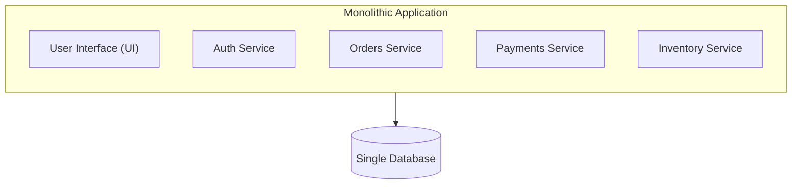
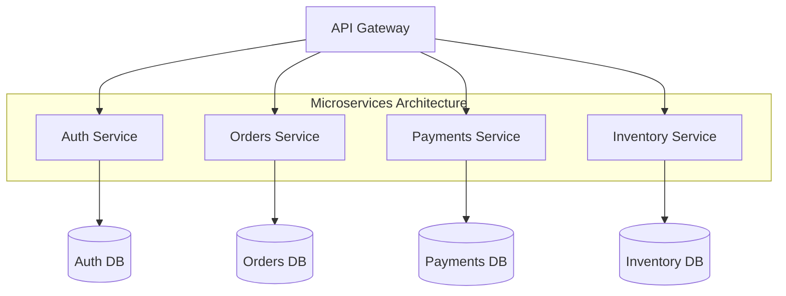

# Day 06 — Architecture Basics

> How you organize code and services into a system. The big debate:
> **monolith vs microservices** — plus the patterns that make either work.

---

## 1. Monolithic architecture

A single deployable unit containing all functionality.



**Pros:** simple to build/test/deploy; fast in-process calls; one codebase; easy
transactions; great for small teams and early-stage products.

**Cons:** scales as one unit; one bug can crash everything; large codebase gets
hard to change; tech stack locked in; long build/deploy times at scale.

> Start with a (well-structured) **monolith**. Split out services only when pain
> appears. "Premature microservices" is a classic mistake.

---

## 2. Microservices architecture

System split into small, independent services, each owning one business
capability and its own data.



**Pros:** independent deploy & scale; fault isolation; tech diversity; team
autonomy; matches large orgs.

**Cons:** distributed-system complexity; network latency & failures; harder
debugging/observability; data consistency across services; DevOps overhead.

---

## 3. Monolith vs Microservices

| Aspect | Monolith | Microservices |
|--------|----------|---------------|
| Deployment | One unit | Many independent |
| Scaling | Whole app | Per service |
| Failure | Cascades | Isolated |
| Data | Shared DB | DB per service |
| Complexity | Low | High |
| Best for | Small teams, MVPs | Large teams, scale |

---

## 4. Service-Oriented Architecture (SOA)

Predecessor to microservices: coarser-grained services often sharing an
**Enterprise Service Bus (ESB)**. Microservices are SOA done finer-grained, with
smart endpoints and dumb pipes.

---

## 5. Key supporting patterns

### API Gateway
Single entry point for clients. Handles routing, auth, rate limiting, SSL
termination, request aggregation. (e.g., Kong, AWS API Gateway, Nginx.)

### Service Discovery
Services find each other dynamically as instances come and go.
- **Client-side** (Eureka) vs **server-side** (load balancer + registry).

### Backend for Frontend (BFF)
A dedicated gateway per client type (web, mobile) tailoring responses.

### Sidecar / Service Mesh
Cross-cutting concerns (mTLS, retries, observability) pushed into a sidecar
proxy (Envoy) managed by a mesh (Istio, Linkerd) — app code stays clean.

---

## 6. Inter-service communication

- **Synchronous** — REST/gRPC request-response. Simple but couples availability
  (caller waits; failures cascade).
- **Asynchronous** — message queue / event bus (Day 11). Decoupled, resilient,
  but eventual consistency.

> Prefer **async events** for cross-service workflows to avoid tight coupling.

---

## 7. Data management across services

- **Database per service** — each service owns its data; no shared DB.
- **Saga pattern** — manage distributed transactions via a sequence of local
  transactions + compensating actions (choreography or orchestration).
- **CQRS** (Command Query Responsibility Segregation) — separate write model
  from read model (optimized read replicas/views).
- **Event Sourcing** — store state as a log of events; rebuild state by replay.

---

## 8. Other architectural styles

- **Event-Driven Architecture** — services react to events; highly decoupled.
- **Serverless / FaaS** — functions run on demand (AWS Lambda); no server mgmt,
  auto-scale, pay-per-use; watch cold starts and statelessness.
- **Layered (n-tier)** — presentation → business → data layers.
- **Hexagonal / Clean** — domain core isolated from infrastructure via ports &
  adapters.

---

## 9. Cross-cutting concerns (apply to any architecture)

- **Configuration management** — externalize config (12-factor).
- **Logging & tracing** — centralized logs, **distributed tracing** (trace IDs).
- **Authentication/Authorization** — OAuth2, JWT, centralized at the gateway.
- **Resilience** — timeouts, retries, circuit breakers (Day 12).

---

## 10. Choosing an architecture

```
Small team / MVP / unclear domain   → Modular Monolith
Clear bounded contexts / big org    → Microservices
Spiky/event workloads, glue code    → Serverless
Heavy read/write asymmetry          → CQRS (+ Event Sourcing)
```

---

> **Key takeaway:** Architecture is about **managing complexity and change**.
> Start simple (modular monolith), split into microservices when team/scale
> demands it, and lean on **API gateways, async messaging, database-per-service,
> and sagas** to keep distributed systems sane.
