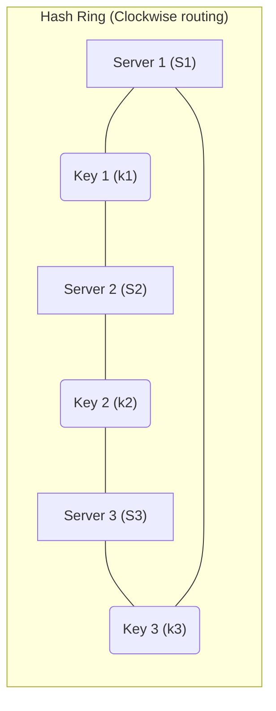

# Day 07 — Load & Scaling

> When one server isn't enough. How to grow capacity and spread traffic without
> falling over.

---

## 1. Vertical vs Horizontal scaling

| | Vertical (Scale Up) | Horizontal (Scale Out) |
|-|---------------------|------------------------|
| How | Bigger machine (CPU/RAM/disk) | More machines |
| Limit | Hardware ceiling | Practically unlimited |
| Complexity | Low (no code change) | High (distributed) |
| Failure | Single point of failure | Fault tolerant |
| Cost | Expensive at top end | Commodity hardware |

> Vertical is the quick fix; **horizontal** is how you reach internet scale.
> Horizontal requires **stateless** services + a **load balancer**.

---

## 2. Load Balancers

Distribute incoming requests across multiple servers.

**Benefits:** spread load, health checks, high availability, SSL termination,
horizontal scaling enabler.

**L4 vs L7:**

| | L4 (Transport) | L7 (Application) |
|-|----------------|------------------|
| Sees | IP + port (TCP/UDP) | HTTP headers, URL, cookies |
| Routing | Fast, dumb | Content-based, smart |
| Examples | AWS NLB, HAProxy(L4) | Nginx, AWS ALB, Envoy |

---

## 3. Load-balancing algorithms

- **Round Robin** — rotate through servers in order.
- **Weighted Round Robin** — bigger servers get more traffic.
- **Least Connections** — send to the server with fewest active connections.
- **Least Response Time** — fastest responder wins.
- **IP Hash** — hash client IP → consistent server (sticky).
- **Consistent Hashing** — minimizes remapping when servers change (see §6).

---

## 4. Sticky sessions

Bind a client to the same server (via cookie/IP hash) so in-memory session data
is found.
- ❌ Breaks pure statelessness and even load distribution.
- ✅ Better: store sessions in **shared Redis** so any server can serve any user.

---

## 5. High availability for the load balancer itself

The LB is a single point of failure → run **redundant LBs** in
**active-passive** (failover) or **active-active** (both serving) with a floating
virtual IP / DNS failover.

---

## 6. Consistent Hashing (critical concept)

Problem: with `server = hash(key) % N`, changing `N` remaps almost everything.

**Consistent hashing** places servers and keys on a **hash ring**; each key goes
to the next server clockwise.



- Add/remove a server → only **K/N keys** move (not all).
- **Virtual nodes** (each server appears at many ring points) → smoother
  distribution and avoids hotspots.
- Used by: Cassandra, DynamoDB, distributed caches, CDNs, sharding.

---

## 7. Scaling the tiers

- **Stateless app servers** — easiest: add instances behind the LB.
- **Database** — hardest: read replicas, sharding (Day 08).
- **Cache** — distributed cache cluster (Day 10).
- **Static content** — offload to CDN + object storage (Day 13).

---

## 8. Auto-scaling

Automatically add/remove instances based on metrics.

- **Reactive** — scale on CPU/memory/QPS thresholds.
- **Scheduled** — scale for known traffic patterns (e.g., 9am spike).
- **Predictive** — ML-based forecasting.
- Concepts: **scale-out/in**, cooldown periods, min/max capacity, warm pools to
  beat cold-start.

---

## 9. Rate limiting & load shedding

Protect the system from overload/abuse.

**Algorithms:**
- **Token Bucket** — tokens refill at a rate; each request spends one; allows bursts.
- **Leaky Bucket** — requests processed at a fixed rate (smooths bursts).
- **Fixed Window** — N requests per time window (simple; edge bursts).
- **Sliding Window** — smoother, avoids window-boundary bursts.

**Load shedding** — drop low-priority requests when overloaded to protect core.

---

## 10. Capacity planning (back-of-envelope)

```
Daily requests / 86,400 ≈ average QPS
Peak QPS ≈ 2–10× average (know your spike factor)
Servers ≈ Peak QPS / (QPS one server handles) × headroom (e.g., ×1.5)
```

Always leave **headroom** (don't run at 100%) and plan for failure of a node/AZ.

---

> **Key takeaway:** Scale **out**, not just up. Keep services **stateless**,
> put a **load balancer** in front (HA, the right algorithm), use **consistent
> hashing** when nodes change, **auto-scale** on demand, and protect yourself
> with **rate limiting + load shedding**.
