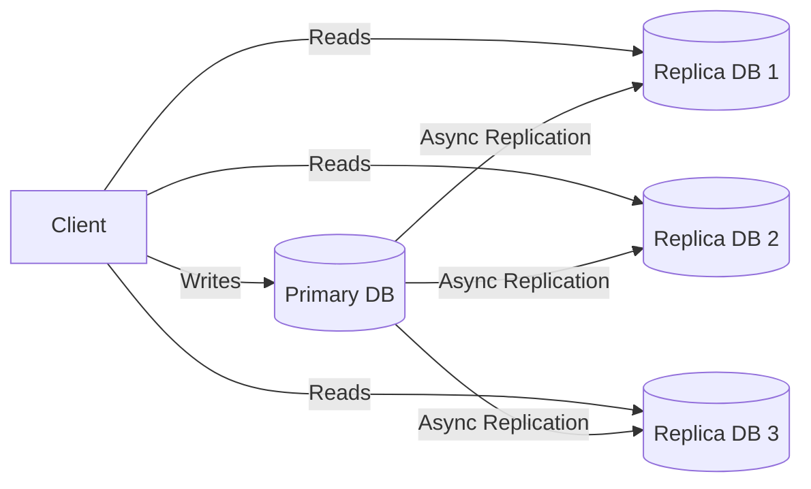

# Day 08 — Database Scaling

> The database is usually the hardest tier to scale. Here's the toolkit:
> replication, partitioning/sharding, federation, and more.

---

## 1. Why the DB is the bottleneck

App servers are stateless and easy to clone. The database holds **state** —
duplicating it without coordination causes inconsistency. So we scale it with
care.

**Order of escalation (cheapest → hardest):**
```
1. Indexing & query optimization
2. Caching (offload reads)
3. Read replicas (scale reads)
4. Vertical scaling (bigger box)
5. Federation (split by feature)
6. Sharding (split by data)
```

---

## 2. Read replicas (replication for scale)

Primary handles writes; replicas serve reads (async copy from primary).



- ✅ Scales **read-heavy** workloads; replicas double as backups/failover.
- ❌ **Replication lag** → reads may be stale (eventual consistency).
- Writes still bottleneck on the single primary. (More in Day 09.)

---

## 3. Vertical partitioning / Federation

Split the database **by feature/table** into separate DBs.

```
Users DB  |  Products DB  |  Orders DB
```

- ✅ Each DB smaller, less contention, scale independently.
- ❌ Cross-feature joins become application-level; more to operate.

---

## 4. Horizontal partitioning = Sharding

Split **rows** of the same table across multiple databases (shards).

```
Shard A: users 1–1M   |  Shard B: users 1M–2M  |  Shard C: ...
```

Each shard is an independent DB holding a subset of the data.

- ✅ Scales **writes and storage** beyond one machine.
- ❌ Most complex: routing, cross-shard queries/joins, rebalancing,
  transactions across shards.

---

## 5. Sharding strategies

| Strategy | How | Pros | Cons |
|----------|-----|------|------|
| **Range-based** | by value range (A–M, N–Z) | simple range queries | **hotspots** if uneven |
| **Hash-based** | `hash(key) % N` | even distribution | hard to range-query; resharding pain |
| **Consistent hashing** | hash ring | minimal data movement on resize | more complex |
| **Directory-based** | lookup table maps key→shard | flexible | lookup is a bottleneck/SPOF |
| **Geo-based** | by region | locality, compliance | uneven geographic load |

> Pick the **shard key** carefully — it should distribute load evenly and match
> your query patterns. A bad shard key creates **hot shards**.

---

## 6. Sharding challenges

- **Cross-shard queries / joins** — must scatter-gather and merge in the app.
- **Hotspots / celebrity problem** — one key (a viral user) overwhelms a shard.
  Mitigate with finer keys, sub-sharding, or caching.
- **Rebalancing** — adding shards moves data; consistent hashing minimizes this.
- **Distributed transactions** — two-phase commit (slow) or **sagas** (Day 06).
- **Global uniqueness** — auto-increment breaks; use UUID/ULID/Snowflake IDs.

---

## 7. Partitioning vs Sharding (terminology)

- **Partitioning** — splitting a table (logical), can be within one DB.
- **Sharding** — partitioning **across multiple machines** (physical).
- Many DBs support **native partitioning** (Postgres declarative partitions);
  sharding is often app-managed or via a layer (Vitess, Citus).

---

## 8. SQL vs NoSQL for scaling

- **NoSQL** (Cassandra, DynamoDB, MongoDB) was built for horizontal scaling —
  sharding/replication are built in.
- **SQL** can scale horizontally too, but it's harder: tools like **Vitess**
  (MySQL), **Citus** (Postgres), or **NewSQL** databases (**CockroachDB**,
  **Spanner**, **YugabyteDB**) give you SQL + horizontal scale + strong
  consistency.

---

## 9. Putting it together — typical evolution

```
Stage 1: Single DB
Stage 2: + Cache + read replicas        (read scaling)
Stage 3: + Federation                   (split by feature)
Stage 4: + Sharding                     (split by data, write scaling)
Stage 5: + NewSQL / managed distributed DB
```

---

## 10. Operational concerns

- **Backups** — regular, tested restores; point-in-time recovery.
- **Connection pooling** — DBs have limited connections (PgBouncer).
- **Monitoring** — slow query logs, replication lag, lock contention.
- **Schema migrations** — online/zero-downtime migrations at scale (expand →
  migrate → contract).

---

> **Key takeaway:** Scale reads with **caching + replicas** first; scale writes
> and storage with **sharding** (choose the shard key wisely to avoid hotspots).
> Federation splits by feature, sharding splits by rows. When SQL + scale +
> strong consistency are all required, reach for **NewSQL**.
