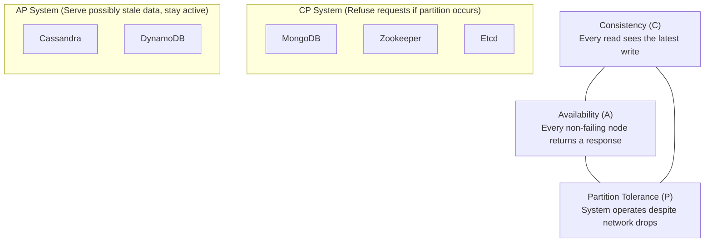

# Day 09 — Replication & Consistency

> Once data lives on more than one machine, you must decide: how do copies stay
> in sync, and what guarantees do readers get? This is the heart of distributed
> systems.

---

## 1. Replication — why and what

**Replication** = keeping copies of data on multiple nodes.

**Why:** high availability (survive node failure), read scalability, lower
latency (geo-local reads), durability.

**The cost:** keeping copies consistent in the presence of failures and network
delays.

---

## 2. Replication topologies

### Single-leader (primary-replica)
One leader takes writes; followers replicate.
- ✅ Simple, no write conflicts.
- ❌ Leader is a write bottleneck & SPOF (needs failover).

### Multi-leader
Multiple nodes accept writes (e.g., per datacenter).
- ✅ Write availability, geo-local writes.
- ❌ **Write conflicts** need resolution (last-write-wins, CRDTs, app logic).

### Leaderless (Dynamo-style)
Any replica accepts reads/writes; uses **quorums** (Cassandra, DynamoDB).
- ✅ Highly available, no failover.
- ❌ Client/coordinator handles consistency via quorums + read repair.

---

## 3. Sync vs Async replication

- **Synchronous** — leader waits for replica(s) to confirm before acking the
  write. ✅ no data loss on failover; ❌ higher latency, lower availability.
- **Asynchronous** — leader acks immediately, replicates in background.
  ✅ fast; ❌ **replication lag** → possible data loss / stale reads.
- **Semi-synchronous** — wait for *at least one* replica (common compromise).

---

## 4. The CAP theorem

In the presence of a **network Partition (P)**, you must choose between
**Consistency (C)** and **Availability (A)**. You can't have all three during a
partition.

- **CP systems** — stay consistent, may reject requests during partition
  (HBase, MongoDB(default), Zookeeper, etcd).
- **AP systems** — stay available, may serve stale data (Cassandra, DynamoDB).
- **CA** — only without partitions, i.e., single-node / not realistic for
  distributed systems.

> In practice partitions *will* happen, so the real choice is **CP vs AP**.

---

## 5. PACELC — the better model

> If there's a **P**artition, choose **A** or **C**; **E**lse (normal operation),
> choose **L**atency or **C**onsistency.

This captures that even without partitions you trade **latency vs consistency**.
(e.g., DynamoDB = PA/EL; Spanner = PC/EC.)

---

## 6. Consistency models (spectrum)

From strongest to weakest:

| Model | Guarantee |
|-------|-----------|
| **Linearizable / Strong** | Every read sees the most recent write; acts like one copy |
| **Sequential** | All nodes see operations in the same order |
| **Causal** | Causally-related ops seen in order; concurrent ops may differ |
| **Read-your-writes** | You always see your own writes |
| **Monotonic reads** | You never see data go "backwards" in time |
| **Eventual** | Given no new writes, replicas eventually converge |

> Stronger consistency = more coordination = higher latency / lower availability.

---

## 7. Quorum consensus (tunable consistency)

With **N** replicas, **W** = write quorum, **R** = read quorum:

- If **W + R > N** → strong consistency (read & write sets overlap).
- Smaller W → faster writes; smaller R → faster reads.
- Examples:
  - `W=N, R=1` — fast reads, slow writes (read-heavy).
  - `W=1, R=N` — fast writes, slow reads.
  - `W=R=⌈(N+1)/2⌉` (majority) — balanced.

Supporting techniques: **read repair**, **hinted handoff**, **anti-entropy /
Merkle trees** to reconcile replicas.

---

## 8. Conflict resolution (multi-leader/leaderless)

- **Last-Write-Wins (LWW)** — by timestamp; simple but can lose data.
- **Vector clocks** — detect causality/concurrency between versions.
- **CRDTs** (Conflict-free Replicated Data Types) — data structures that merge
  automatically (counters, sets).
- **Application-level merge** — let business logic decide (e.g., shopping cart union).

---

## 9. Consensus algorithms

To agree on a value/leader despite failures:

- **Paxos** — classic, hard to implement.
- **Raft** — understandable; used by etcd, Consul, CockroachDB.
- **Zab** — Zookeeper.

Used for leader election, distributed locks, config, metadata.

---

## 10. Practical guidance

- **Banking/inventory** → strong consistency (CP / linearizable).
- **Social feeds, likes, view counts** → eventual consistency (AP) is fine.
- Offer **read-your-writes** for UX (a user must see their own post immediately).
- Beware **replication lag** when reading from replicas after a write.

---

> **Key takeaway:** Replication buys availability and read scale but forces a
> **consistency vs availability/latency** trade-off (**CAP/PACELC**). Pick a
> consistency model per use case, use **quorums (W+R>N)** for tunable
> guarantees, and handle conflicts with vector clocks/CRDTs.
