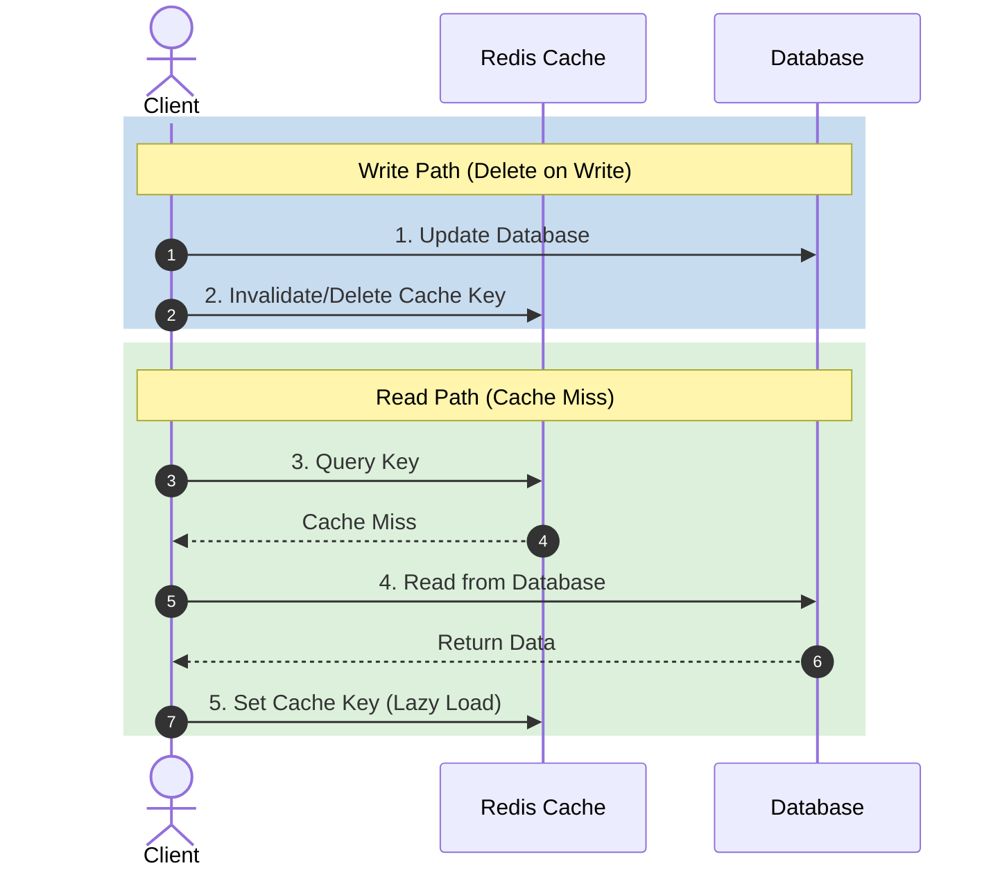

# Day 10 — Advanced Caching

> Beyond basics (Day 05): distributed caches, the hard failure modes, and the
> patterns that keep a cache layer fast *and* correct at scale.

---

## 1. Distributed caching

A single cache node can't hold all hot data or all the load → spread the cache
across many nodes.

**How to distribute keys across nodes:**
- **Modulo hashing** `node = hash(key) % N` — simple but **resharding remaps
  almost everything** when N changes.
- **Consistent hashing** (Day 07) — only `K/N` keys move when adding/removing a
  node; the standard for distributed caches.

**Topologies:**
- **Client-side sharding** — client library routes keys (e.g., Memcached client).
- **Proxy-based** — proxy (Twemproxy) routes to nodes.
- **Cluster mode** — cache itself manages sharding & replication (Redis Cluster).

---

## 2. Replication & HA for caches

- **Redis replication** — primary + replicas; replicas serve reads / take over.
- **Redis Sentinel** — monitors, automatic failover, notifies clients.
- **Redis Cluster** — sharding (16384 hash slots) + replication built in.

---

## 3. The three classic cache failure modes

### Cache Penetration
Requests for **keys that don't exist** miss the cache *and* the DB every time
(often malicious). 
- **Fix:** cache the "null" result (with short TTL); use a **Bloom filter** to
  reject keys that definitely don't exist before hitting the DB.

### Cache Avalanche
**Many keys expire at the same time** (or the whole cache restarts cold) → flood
of DB requests.
- **Fix:** **jitter/randomize TTLs**, warm the cache on startup, use a highly
  available cache, add circuit breakers.

### Cache Stampede (Thundering Herd / Dogpile)
One **hot key expires** and thousands of concurrent requests all miss and hit
the DB simultaneously to recompute it.
- **Fix:**
  - **Locking / single-flight** — first request recomputes; others wait/serve stale.
  - **Refresh-ahead** — proactively refresh before expiry.
  - **Probabilistic early expiration** — recompute slightly before TTL at random.

---

## 4. Bloom filters (probabilistic membership)

A space-efficient structure answering "is this key *possibly* in the set?"

- **No false negatives** (if it says "not present", it's truly absent).
- **Possible false positives** (says "maybe present" when it isn't).
- Use to short-circuit lookups for definitely-missing keys → kills penetration
  and saves DB hits. Variants: Counting Bloom (supports delete), Cuckoo filter.

---

## 5. Cache consistency patterns

Keeping cache ⇄ DB consistent is genuinely hard.

- **Cache-aside + delete-on-write** (most common):

  *Prefer delete over update* to avoid stale writes from races.
- **Race window:** a read can repopulate stale data between DB update and cache
  delete. Mitigations: **delete-then-update ordering**, short TTLs, versioned
  keys, or **write-through**.
- **Double delete** — delete cache, write DB, delete cache again after a small
  delay to close concurrent-read races.
- **Change Data Capture (CDC)** — stream DB changes (Debezium → Kafka) to
  invalidate/update caches reliably.

---

## 6. Eviction at scale

- **LRU / LFU / TTL** (recap from Day 05).
- Redis policies: `noeviction`, `allkeys-lru`, `allkeys-lfu`, `volatile-ttl`,
  `volatile-lru`, etc.
- **Memory pressure** → eviction storms; size cache for working set + headroom.

---

## 7. Hot key & big key problems

- **Hot key** — one key gets disproportionate traffic (a celebrity, a viral
  item). *Fix:* local/in-process cache in front of the distributed cache, key
  replication across nodes, request coalescing.
- **Big key** — a single huge value (large list/hash) causes latency spikes and
  uneven memory. *Fix:* split into smaller keys; avoid storing huge blobs.

---

## 8. Multi-level caching

```
L1: In-process (app memory, e.g., Caffeine)  — ns, per-instance
L2: Distributed cache (Redis)                — sub-ms, shared
L3: CDN / edge                               — geo, static
Source of truth: Database
```

- L1 reduces network hops for the hottest data; L2 shares across instances.
- Watch **L1 coherence** across instances (TTL or pub/sub invalidation).

---

## 9. Cache warming & write strategies (recap + scale)

- **Warm** critical keys at deploy/startup to avoid cold-start avalanche.
- Choose **write-through / write-back / write-around** per workload (Day 05).
- **Write-back** boosts write throughput but risks loss → persist/replicate.

---

## 10. Observability

Track: **hit ratio**, evictions/sec, memory usage, p99 latency, connection
count, replication lag, hot keys. A falling hit ratio is an early warning.

---

> **Key takeaway:** At scale, distribute the cache with **consistent hashing**,
> make it **HA** (replication/cluster), and defend against the big three —
> **penetration (Bloom filters/null caching), avalanche (TTL jitter), and
> stampede (locks/refresh-ahead)**. Keep cache/DB consistent with
> **delete-on-write** (or CDC), and watch out for **hot/big keys**.
