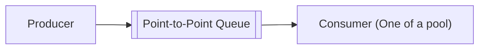
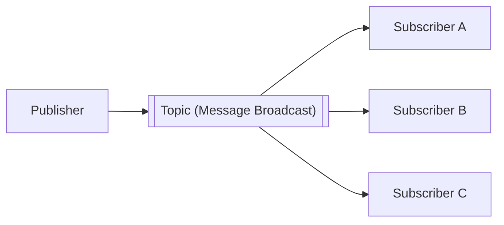

# Day 11 — Messaging Systems

> Asynchronous messaging decouples producers from consumers, absorbs traffic
> spikes, and is the backbone of event-driven and microservice architectures.

---

## 1. Why async messaging?

**Synchronous** calls couple services: caller waits, failures cascade, spikes
overwhelm. **Async messaging** fixes this:

- **Decoupling** — producer doesn't know/care who consumes.
- **Buffering / load leveling** — queue absorbs bursts; consumers work at their pace.
- **Resilience** — if a consumer is down, messages wait.
- **Scalability** — add consumers to process faster.
- **Async workflows** — fire-and-forget for slow tasks (email, thumbnails).

Trade-off: **eventual consistency**, ordering complexity, and operational
overhead.

---

## 2. Two core patterns

### Message Queue (point-to-point)
Each message is consumed by **exactly one** consumer.

Great for **task/work distribution** (e.g., process this job).

### Publish/Subscribe (pub/sub)
Each message is delivered to **all** subscribers.

Great for **broadcasting events** (e.g., "OrderPlaced" → billing, shipping,
analytics all react).

---

## 3. Delivery guarantees

| Guarantee | Meaning | Trade-off |
|-----------|---------|-----------|
| **At-most-once** | May lose messages, never duplicates | Fast, lossy |
| **At-least-once** | Never lost, may duplicate | Needs **idempotent** consumers |
| **Exactly-once** | No loss, no dups | Hardest; often "effectively once" |

> Most systems give **at-least-once** → design consumers to be **idempotent**
> (processing the same message twice is safe), often via dedup keys.

---

## 4. Ordering

- Global ordering across a distributed queue is expensive.
- **Partition/key-based ordering** — messages with the same key go to the same
  partition and stay ordered (Kafka's model).
- If you need order, choose a partition key (e.g., `userId`) carefully.

---

## 5. Key concepts & components

- **Producer / Consumer** — write / read messages.
- **Broker** — the messaging server (Kafka broker, RabbitMQ node).
- **Topic / Queue** — logical channel.
- **Partition** — a topic split for parallelism & ordering.
- **Consumer group** — consumers sharing the work of a topic (each partition →
  one consumer in the group).
- **Offset** — a consumer's position in the log.
- **Acknowledgement (ack)** — consumer confirms processing; unacked messages
  are redelivered.
- **Dead Letter Queue (DLQ)** — messages that repeatedly fail land here for
  inspection.
- **Backpressure** — signal/slow producers when consumers fall behind.

---

## 6. Kafka vs RabbitMQ (the two you'll be asked about)

| | Kafka | RabbitMQ |
|-|-------|----------|
| Model | Distributed **log** | Traditional **message broker** |
| Retention | Keeps messages (replayable) | Deleted after ack (by default) |
| Throughput | Very high (millions/sec) | High (lower than Kafka) |
| Ordering | Per partition | Per queue |
| Routing | Simple (topic/partition) | Rich (exchanges, routing keys) |
| Best for | Event streaming, logs, analytics, replay | Task queues, complex routing, RPC |

Others: **Amazon SQS/SNS**, **Google Pub/Sub**, **Apache Pulsar**, **NATS**,
**Redis Streams**.

---

## 7. Kafka essentials

- A **topic** is an append-only **log** split into **partitions**.
- Each partition is replicated across brokers (leader + followers).
- Consumers track **offsets**; can **replay** from any offset (huge advantage).
- Ordering guaranteed **within a partition**, not across.
- Scales by adding partitions/brokers; consumer groups parallelize consumption.

---

## 8. Common architectural patterns

- **Event-Driven Architecture** — services emit & react to events.
- **Event Sourcing** — store state as an immutable event log; rebuild by replay.
- **CQRS** — events update read models asynchronously.
- **Outbox pattern** — write event to a DB "outbox" table in the same
  transaction as the business change, then relay to the broker (avoids the
  dual-write problem / lost events).
- **Saga** — coordinate distributed transactions via events + compensations.
- **Stream processing** — Kafka Streams / Flink for real-time aggregation.

---

## 9. Reliability concerns

- **Idempotency** — dedup with message IDs / idempotency keys.
- **Retries with backoff** — avoid hammering a failing consumer.
- **DLQ + alerting** — don't silently drop poison messages.
- **Exactly-once illusion** — usually achieved via idempotency + transactional
  writes, not literal exactly-once delivery.

---

## 10. When NOT to use a queue

- Simple, low-latency request/response where the caller needs the result now
  (use sync REST/gRPC).
- When added operational complexity outweighs decoupling benefits.

---

> **Key takeaway:** Use **queues** to decouple, buffer spikes, and run async
> work. Know **queue vs pub/sub**, **delivery guarantees** (design for
> at-least-once → **idempotent** consumers), and **Kafka vs RabbitMQ**. Reach
> for the **outbox pattern** to publish events reliably and **DLQs** to handle
> failures.
