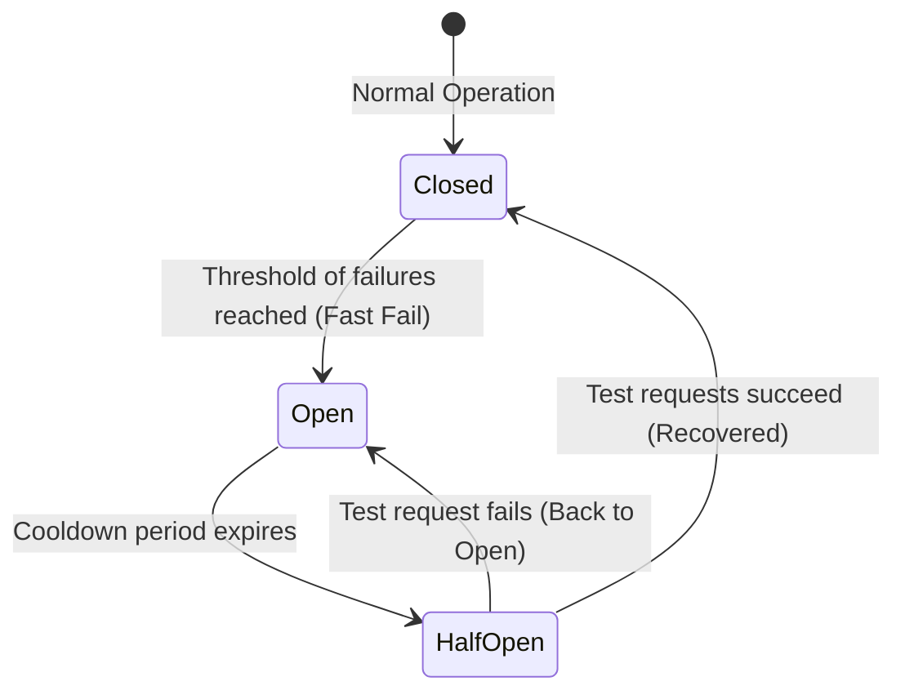

# Day 12 — Reliability

> A system that's fast but falls over isn't useful. Reliability = staying
> correct and available despite failures. In distributed systems, **failure is
> the normal case**, not the exception.

---

## 1. The reliability vocabulary

- **Availability** — % of time the system is operational (uptime).
- **Reliability** — performs correctly over time (no wrong results / data loss).
- **Fault tolerance** — keeps working despite component failures.
- **Resilience** — recovers gracefully from failures.
- **Durability** — committed data is never lost.

---

## 2. Availability — the "nines"

| Availability | Downtime / year | Downtime / day |
|--------------|-----------------|----------------|
| 90% (1 nine) | ~36.5 days | ~2.4 h |
| 99% (2 nines) | ~3.65 days | ~14 min |
| 99.9% (3 nines) | ~8.8 h | ~86 s |
| 99.99% (4 nines) | ~52 min | ~8.6 s |
| 99.999% (5 nines) | ~5.3 min | ~0.86 s |

- Components in **series** multiply: `A_total = A1 × A2` (worse).
- Components in **parallel** (redundant) improve: `A = 1 − (1−A1)(1−A2)`.

> Redundancy is how you add nines. Every dependency in the request path lowers
> availability unless it's redundant or optional.

---

## 3. SLA / SLO / SLI

- **SLI** (Indicator) — a measured metric (e.g., p99 latency, error rate).
- **SLO** (Objective) — internal target (e.g., 99.9% success).
- **SLA** (Agreement) — contractual promise to customers (with penalties).
- **Error budget** = `1 − SLO`. Spend it on releases/risk; freeze when exhausted.

---

## 4. Eliminating single points of failure (SPOF)

A **SPOF** is any component whose failure takes down the system.

- **Redundancy** — N+1 / N+2 instances; **active-active** or **active-passive**.
- **Replication** — data on multiple nodes (Day 09).
- **Multi-AZ / Multi-region** — survive datacenter/region outages.
- **No single LB/DB/cache without a standby.**

---

## 5. Resilience patterns (the toolkit)

### Timeouts
Never wait forever on a dependency. Bound every network call.

### Retries (with backoff + jitter)
Retry transient failures, but use **exponential backoff + jitter** to avoid
retry storms. Only retry **idempotent** operations.

### Circuit Breaker
Stop calling a failing dependency to let it recover and fail fast.

### Bulkhead
Isolate resources (thread pools/connections) per dependency so one failure
can't sink the whole ship.

### Rate limiting & Load shedding
Reject/drop excess or low-priority load to protect the core (Day 07).

### Graceful degradation / Fallbacks
Serve reduced functionality instead of failing entirely (e.g., cached/stale
data, default recommendations, "lite" mode).

### Idempotency
Make repeated operations safe — essential with retries and at-least-once
messaging.

---

## 6. Redundancy & failover strategies

| Strategy | Description | Trade-off |
|----------|-------------|-----------|
| **Active-Passive** | Standby takes over on failure | Idle capacity; failover delay |
| **Active-Active** | All nodes serve traffic | Full utilization; needs sync |
| **Hot/Warm/Cold standby** | Readiness vs cost | Faster failover = more cost |

**Failover** must be automatic and tested (leader election, health checks,
DNS/VIP switch).

---

## 7. Health checks & self-healing

- **Liveness** — is the process alive? (restart if not)
- **Readiness** — can it serve traffic? (pull from LB if not)
- Load balancers & orchestrators (Kubernetes) auto-restart/replace unhealthy
  instances.

---

## 8. Data durability & backups

- **Replication** for availability ≠ **backups** for recovery (a bad write
  replicates too!). Keep both.
- **3-2-1 rule** — 3 copies, 2 media, 1 offsite.
- **Point-in-time recovery**, write-ahead logs, regular **restore drills**
  (an untested backup is not a backup).

---

## 9. Observability (you can't fix what you can't see)

The three pillars:
- **Metrics** — numeric time-series (Prometheus): latency, error rate,
  saturation, traffic ("RED"/"USE" methods).
- **Logs** — structured, centralized, correlated by request/trace ID.
- **Traces** — distributed tracing across services (OpenTelemetry, Jaeger).

Plus **alerting** on SLO burn rate and **dashboards**.

---

## 10. Operational practices

- **Graceful shutdown / rolling deploys** — drain connections; no dropped requests.
- **Blue-green & canary deployments** — reduce blast radius of releases.
- **Chaos engineering** — inject failures (Chaos Monkey) to prove resilience.
- **Runbooks & on-call** — known procedures for known failures.
- **Blameless postmortems** — learn from incidents.

---

> **Key takeaway:** Assume everything fails. Add **redundancy** to kill SPOFs and
> earn your nines, bound failures with **timeouts, retries+backoff, circuit
> breakers, and bulkheads**, **degrade gracefully**, keep **tested backups**,
> and make the system **observable** so you can detect and recover fast.
