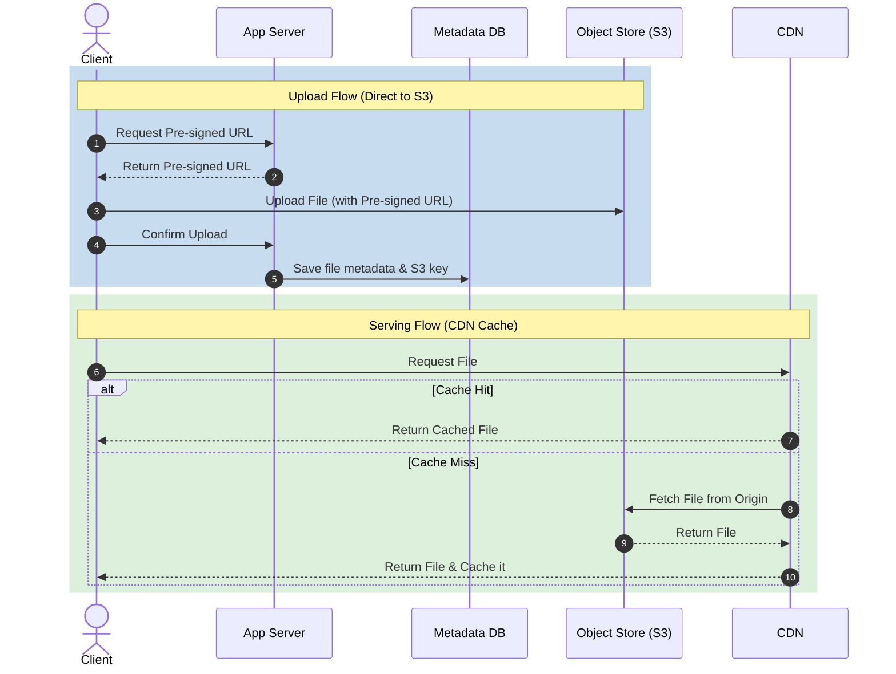
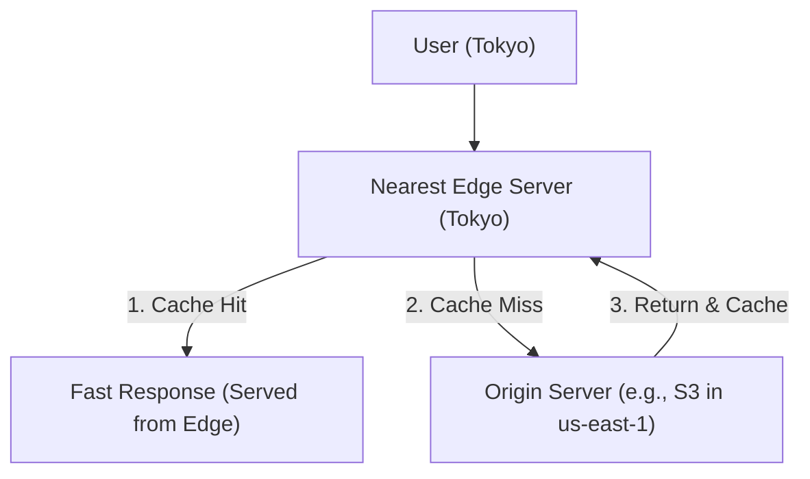

# Day 13 — Storage & CDN

> Where do files, images, videos, and backups live — and how do you serve them
> fast to users across the globe? Storage types + Content Delivery Networks.

---

## 1. The three storage types

| Type | Unit | Access | Examples | Best for |
|------|------|--------|----------|----------|
| **Block storage** | Fixed-size blocks (like a raw disk) | Attached to one server, low-level | AWS EBS, SAN, iSCSI | Databases, VMs, high-IOPS |
| **File storage** | Files in a hierarchy | Shared filesystem (NFS/SMB) | AWS EFS, NAS | Shared dirs, legacy apps |
| **Object storage** | Objects (data + metadata + ID) | HTTP API, flat namespace | AWS S3, GCS, Azure Blob | Media, backups, static sites, data lakes |

```
Block  → "a hard drive"      → fast, attached, structured by the FS on top
File   → "a shared folder"   → hierarchy of folders/files, shared over network
Object → "a giant key-value store for blobs" → infinitely scalable, web-native
```

---

## 2. Object storage deep dive (S3-style)

The default for internet-scale unstructured data.

- **Objects** stored in **buckets**, each with a unique key, the data, and rich
  **metadata**; accessed via REST API / URL.
- **Flat namespace** — "folders" are just key prefixes (`images/2024/cat.jpg`).
- **Massively scalable & durable** — e.g., S3 advertises **11 nines** of
  durability via replication across devices/AZs.
- **Storage classes / tiering** — hot (frequent), infrequent-access, archive
  (Glacier) → cost vs retrieval-time trade-off; lifecycle policies auto-tier.
- **Features** — versioning, encryption at rest, access control (IAM/policies),
  **pre-signed URLs** (temporary direct upload/download), event notifications.

**Why apps offload to object storage:** keeps app servers stateless, cheap and
durable, and integrates directly with **CDNs**.

---

## 3. File upload/serving pattern



> Don't stream large files through your app servers — use **pre-signed URLs**
> and let the object store / CDN do the heavy lifting.

---

## 4. What is a CDN?

A **Content Delivery Network** is a globally distributed network of **edge
servers** that cache content close to users.



**Examples:** Cloudflare, Akamai, AWS CloudFront, Fastly, Google Cloud CDN.

---

## 5. Why use a CDN?

- **Lower latency** — content served from geographically nearby edge.
- **Reduced origin load** — most requests served from cache.
- **Higher availability & DDoS protection** — absorb/spread traffic.
- **Bandwidth cost savings** — offload egress from origin.
- **TLS termination at the edge**, compression, image optimization.

---

## 6. How a CDN works

1. User requests `cdn.site.com/logo.png`.
2. **Anycast** DNS routes to the nearest edge PoP (Point of Presence).
3. **Cache hit** → edge serves immediately.
4. **Cache miss** → edge fetches from **origin**, caches it, then serves; later
   users in that region get a hit.

**Routing techniques:** Anycast (same IP advertised from many locations),
DNS-based geo-routing.

---

## 7. Push vs Pull CDNs

| | **Pull CDN** | **Push CDN** |
|-|--------------|--------------|
| How content arrives | Edge fetches from origin on first miss (lazy) | You upload content to the CDN proactively |
| Best for | Frequently updated / large catalogs | Static, infrequently changing assets |
| Effort | Low (set it and forget it) | More (manage uploads) |
| Origin traffic | First request per region hits origin | Minimal |

Most web traffic uses **pull** CDNs.

---

## 8. Caching control & invalidation

- **`Cache-Control`** headers — `max-age`, `public/private`, `no-cache`,
  `s-maxage` (shared/CDN TTL).
- **`ETag` / `Last-Modified`** — conditional requests; `304 Not Modified`
  avoids re-download.
- **TTL** — how long edges keep content.
- **Invalidation / purge** — explicitly evict updated content from edges.
- **Cache busting** — version the URL (`app.v3.js`, content-hash filenames) so
  new content has a new URL — the cleanest way to update cached assets.

---

## 9. Static vs Dynamic content at the edge

- **Static** (images, CSS, JS, video) — ideal CDN candidates, long TTLs.
- **Dynamic** (personalized API responses) — use **dynamic acceleration**
  (optimized routing/connection reuse to origin), **edge compute**
  (Cloudflare Workers, Lambda@Edge), and micro-caching (short TTLs).

---

## 10. Designing media-heavy systems (e.g., video/image platform)

```
Upload → Object Store (S3) → processing (transcode/resize via queue+workers)
       → store variants in S3 → serve via CDN
Metadata (URLs, sizes, owner) → database
```

- Generate multiple resolutions/formats; serve adaptive bitrate (HLS/DASH) for
  video.
- Use **signed CDN URLs** for access control on private media.
- Combine **object storage (durable origin) + CDN (fast global delivery)**.

---

> **Key takeaway:** Match storage to need — **block** (disks/DBs), **file**
> (shared FS), **object** (web-scale blobs, the default for media/backups).
> Put a **CDN** in front of static/media content to cut latency and origin load;
> understand **pull vs push**, **cache-control + invalidation**, and
> **cache-busting** via versioned URLs.
