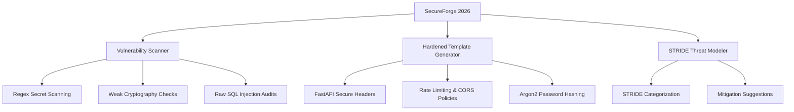

# 🛡️ SecureForge 2026: Application Security & Hardening Tool

SecureForge 2026 is a security analysis tool designed to audit, harden, and bootstrap Python applications using secure-by-design patterns aligned with OWASP Top 10 (2026) standards.

---

## 🧭 Core Capabilities



1. **Security Vulnerability Scanner**:
   - Parses codebases to locate hardcoded API keys/secrets, weak hashing algorithms (MD5, SHA-1), raw SQL query string interpolation, wild-card CORS configurations, and insecure pseudo-random generators.
2. **Hardened FastAPI Template Generator**:
   - Generates a production-grade FastAPI microservice template featuring secure CSP/HSTS headers, rate-limiting, CORS limits, and PBKDF2/SHA-256 cryptographic utilities.
3. **STRIDE Threat Modeler**:
   - Generates customized markdown threat models categorized by STRIDE definitions (Spoofing, Tampering, Repudiation, Information Disclosure, Denial of Service, Elevation of Privilege) with remediation checklists.

---

## 💻 CLI Usage Guide

Execute scanner, generator, or threat modeler tasks directly via the CLI:

### A. Scan a Directory for Vulnerabilities
Scan a target directory or file for security violations:
```bash
python -m tools.appsec_forge.cli scan --path ./projects/parking_lot
```

### B. Generate a Hardened FastAPI Template
Bootstrap a secure FastAPI microservice structure:
```bash
python -m tools.appsec_forge.cli generate --output ./my_secured_service
```

### C. Run STRIDE Threat Modeling
Generate an architectural STRIDE threat model:
```bash
python -m tools.appsec_forge.cli threat --type web --output threat_model.md
```

---

## 🔌 REST API Endpoints (FastAPI)

| Method | Endpoint | Description | Payloads / Parameters |
| :---: | :--- | :--- | :--- |
| `POST` | `/sec/scan` | Perform static vulnerability scan on a local codebase | `file_path` |
| `POST` | `/sec/generate` | Generate secure FastAPI template code at a destination | `output_path` |
| `POST` | `/sec/threat-model` | Generate STRIDE threat model markdown for an application | `app_type` |
