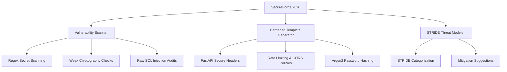

# SecureForge 2026: Automated Application Security & Hardening Tool

SecureForge 2026 is a specialized tool designed to evaluate, secure, and bootstrap Python applications using modern "Secure by Design" paradigms. It offers automated code scanning, threat modeling, and boilerplate generation aligned with OWASP Top 10 (2026) standards.

---

## 1. Core Capabilities



1. **Security Vulnerability Scanner**:
   - Parses codebases to detect hardcoded API keys/passwords, weak hashes (MD5, SHA-1), raw SQL query string interpolation, wild-card CORS configurations, and insecure random number generators.
2. **Hardened FastAPI Template Generator**:
   - Automatically generates a complete, secure FastAPI microservice boilerplate containing CSP headers, HSTS, rate-limiting, CORS middleware, Pydantic inputs sanitization, and Argon2-based cryptographic utilities.
3. **STRIDE Threat Modeler**:
   - Generates custom STRIDE threat models (Spoofing, Tampering, Repudiation, Information Disclosure, Denial of Service, Elevation of Privilege) based on the application's components.

---

## 2. CLI Usage Guide

You can run the scanner or generator directly using python commands:

### A. Scanning a Directory for Vulnerabilities
Scan any directory or file for insecure patterns:
```bash
python -m tools.appsec_forge.cli scan --path ./projects/parking_lot
```

### B. Generating a Secure Project Template
Generate a secure, hardened FastAPI project boilerplate in a directory:
```bash
python -m tools.appsec_forge.cli generate --output ./my_secured_service
```

### C. Running Threat Modeling
Generate a markdown threat model for your architecture:
```bash
python -m tools.appsec_forge.cli threat --type web --output threat_model.md
```

---

## 3. Web Service API

SecureForge 2026 is also equipped with its own FastAPI server:
- **`POST /sec/scan`**: Send source code files to analyze.
- **`POST /sec/generate`**: Receive a zip/text dump of secure boilerplate templates.
- **`POST /sec/threat-model`**: Get STRIDE threat models for your design schema.
